# 🎬 Vicinema - Movie Ticket Booking System
  


> A full-stack, real-time movie ticket booking platform built with **.NET 10** and **React 19** — designed to demonstrate production-grade Clean Architecture, domain-driven design, and modern DevOps practices.

### Read in other languages
- [Vietnamese/Tiếng Việt](./README.vi.md)


## 📖 Table of Contents

- [📌 Overview](#overview)
- [🚀 Key Features](#key-features)
- [🛠 Tech Stack](#tech-stack)
- [🏗 Architecture](#architecture)
- [📂 Project Structure](#project-structure)
- [⚙️ Getting Started](#getting-started)
- [📸 Live Demo](#live-demo)
- [🖼 Highlight Screenshots](#highlight-screenshots)
- [📬 Contact](#contact)
- [📄 License](#license)

---

## Overview

Cinema Ticket Booking is an end-to-end web application that allows customers to browse movies, select showtimes, choose seats in real-time, and complete payments via VNPay or Momo gateways. An admin panel (ASP.NET Core MVC) provides cinema operators with full control over movies, screens, showtimes, pricing policies, and booking management.

**Goals:**
- Deliver a seamless, real-time booking experience with seat-locking and live status updates.
- Showcase enterprise-level architecture patterns: Clean Architecture, CQRS, Domain Events, and Unit of Work.
- Provide a fully containerized development and production environment with observability built in.

### Summary report
For a detailed analysis of the project structure, including Domain Aggregates, CQRS commands/queries, event handlers, and full API endpoint metrics, refer to the [Cinema Ticket Booking Project Summary Report](documents/reports/summary-report-28-06-26.md).

---

## Key Features

| Feature | Description |
|---|---|
| **Real-time Seat Status Update** | SignalR hubs broadcast ticket lock/unlock events instantly — multiple users see the same seat map live |
| **Seat Locking** | Redis-based seat locking with fallbacks to Postgres advisory locks and optimistic concurrency via xmin. |
| **Seat Selection Rules** | Flexible rules to prevent invalid seat selection (gaps between seats, orphaned seats, multiple rows, between aisle, etc...). Administrators can flexibly configure the enforcement level: Block/Warn/Allow for each rule |
| **Online Payment Integration** | VNPay & Momo payment gateways with IPN webhook verification, configurable timeouts, and allows users to retry with a different payment method if an error occurs |
| **Dynamic Ticket Pricing** | Flexible pricing policies per screen, day-of-week, and showtime — managed easily from the admin portal. |
| **Customer Loyalty** | Loyalty program for customers to earn points, upgrade membership tiers (Silver, Gold, Platinum...), enjoy discounts, and receive coupons |
| **Coupons** | Allows customers to apply discount coupons directly during booking |
| **Promotion Programs** | Automatically scans and applies eligible promotion programs during booking. Supports flexible management of application scope, value limits, and discount types |
| **Showtime Scheduling** | Smart showtime management with automated conflict detection, incorporating movie duration, trailer time, cleanup buffers, and automatic showtime status transitions on time |
| **Authentication & Authorization** | ASP.NET Core Identity with JWT + HttpOnly refresh-token cookies, role-based access control, and social login support (Google & Facebook OAuth) |
| **Admin Portal** | Rich admin interface for managing Cinemas, Screens, Movies, Showtimes, Pricing, Promotions, Coupons, detailed role permissions, and an intuitive revenue dashboard |
| **Recovery jobs** | Background tasks periodically scanning and releasing expired locked seats (exceeding 10 minutes), and automating daily showtime schedules |

---

## Tech Stack

### Backend
| Technology | Version | Purpose |
|---|---|---|
| **.NET / ASP.NET Core** | 10.0+ | Web framework — MVC for admin, Minimal APIs for frontend |
| **Entity Framework Core** | 10.0+| ORM, migrations, data seeding |
| **Dapper** | 2.1+ | High-performance raw SQL queries where needed |
| **Wolverine** | 5.8+ | CQRS command/query bus + domain event messaging |
| **SignalR** | Built-in .NET 10 | Real-time WebSocket communication (ticket & payment hubs) |
| **ASP.NET Core Identity** | 10.0+ | Authentication, authorization, role management |
| **Scalar** | 2.13+ | Interactive API documentation (OpenAPI) |
| **Serilog** | 10.0+ | Structured logging with sinks for File, Console, and Loki |
| **xUnit** | 2.9+ | Unit and integration testing framework |

### Frontend
| Technology | Version | Purpose |
|---|---|---|
| **React** | 19.2+ | SPA for customer-facing booking flow |
| **TypeScript** | 6.0+ | Type-safe frontend development |
| **Vite** | 8.0+ | Lightning-fast dev server & build tool |
| **Tailwind CSS** | 3.4+ | Utility-first styling |
| **Axios** | 1.15+ | HTTP client for API communication |
| **@microsoft/signalr** | 10.0+ | Real-time connection to backend hubs |
| **React Router** | 19.2+ | Client-side routing |

### Database & Caching
| Technology | Version | Purpose |
|---|---|---| 
| **PostgreSQL 17** | 17+ | Primary relational database |
| **Redis** | 7+ | Distributed caching & seat-lock management |

### DevOps & Observability
| Technology | Version | Purpose |
|---|---|---|
| **Docker & Docker Compose** | 28.3+ | Containerized development & production environments |
| **.NET Aspire** | 13.2+ | Service orchestration, service discovery, OpenTelemetry |
| **GitHub Actions** | - | CI/CD — test → build → push Docker images → deploy |
| **Coolify** | 4.0.0 | Self-hosted PaaS for deployment on AWS EC2 |
| **Prometheus** | 2.55+ | Metrics collection (app + PostgreSQL + Redis) |
| **Grafana** | 11.6+ | Dashboards & alerting |
| **Loki** | 3.2+ | Log aggregation |
| **Tempo** | 2.6+ | Request tracing (OpenTelemetry) |

---

## Architecture

### Design Principles

- **Clean Architecture** — strict dependency inversion: Domain → Application → Infrastructure → Presentation (WebServer)
- **Domain-Driven Design (DDD)** — rich domain entities with encapsulated business rules, domain events, and value objects
- **CQRS** — commands and queries separated via Wolverine message bus
- **Repository + Unit of Work** — data access abstraction with transactional consistency
- **Domain Events** — side effects handled through Wolverine messaging pipeline (e.g., `BookingConfirmed → SendConfirmationEmail`)

### System Diagram

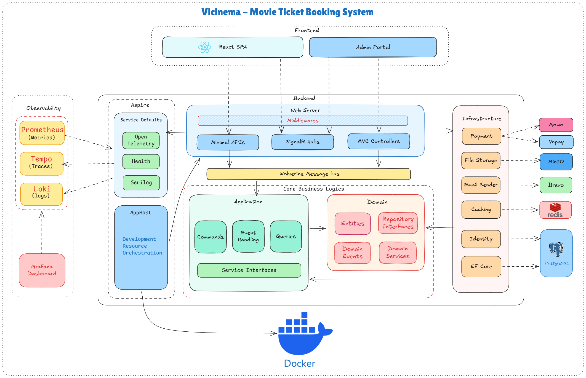

### Entity Relationship Diagram

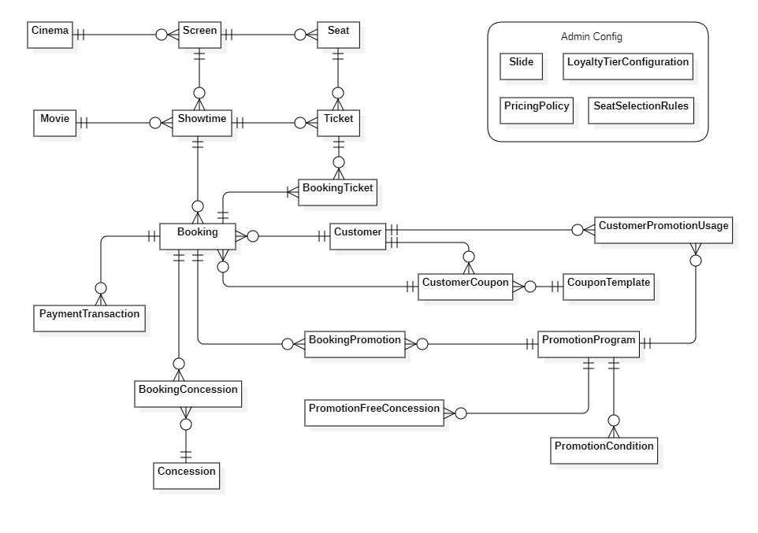

---

## Project Structure

```
📁 src/
├── Aspire.AppHost/                        # .NET Aspire orchestration, service discovery, OpenTelemetry
├── Aspire.ServiceDefaults/                # Shared Aspire defaults (logging, tracing config)
│
├── CinemaTicketBooking.Domain/            # Core business logic (zero external dependencies)
│   ├── Abstractions/                      # Base entity
│   ├── Constants/                         # MaxLength constants for validation, Seat grid cell values, etc.
│   ├── Entities/                          # Cinema, Screen, Movie, ShowTime, Booking, Ticket, etc.
│   ├── Enums/                             # BookingStatus, PaymentMethod, SeatType, etc.
│   ├── Events/                            # Domain events per aggregate
│   ├── Repositories/                      # Repository interfaces
│   ├── Services/                          # Domain services
│   └── Utilities/                         # Helper utilities
│
├── CinemaTicketBooking.Application/       # Use cases & orchestration
│   ├── Abstractions/                      # Service interfaces, UoW, markers
│   ├── Common/                            # Shared DTOs, pagination, result types
│   ├── Features/                          # CQRS commands & queries per aggregate
│   └── EventHandling/                     # Domain event handlers (side effects)
│
├── CinemaTicketBooking.Infrastructure/    # External concerns implementation
│   ├── Auth/                              # Identity, JWT, OAuth, role seeding
│   ├── Cache/                             # Redis cache implementations
│   ├── FileStorages/                      # File storage implementations
│   ├── Notifications/                     # Email sender
│   ├── Payments/                          # Online payment gateway implementations
│   └── Persistence/                       # EF Core DbContext, migrations, repositories
│
├── CinemaTicketBooking.WebServer/         # ASP.NET Core host
│   ├── ApiEndpoints/                      # Minimal API endpoints
│   ├── Controllers/                       # MVC admin controllers
│   ├── CronJobs/                          # Background hosted services
│   ├── Hubs/                              # Real-time SignalR hubs
│   ├── Middlewares/                       # Http middlewares
│   ├── Models/                            # View models for MVC
│   └── Views/                             # Razor views for admin panel
│
└── CinemaTicketBooking.WebApp/            # React 19 SPA (Vite + TypeScript)
    ├── src/                               # Components, pages, hooks, services
    └── public/                            # Static assets

📁 tests/
├── CinemaTicketBooking.UnitTests/         # Unit tests
└── CinemaTicketBooking.IntegrationTests/  # Integration tests (Testcontainers)

📁 dockers/
├── development/                           # Full dev stack (app + DB + cache + monitoring)
├── production/                            # Production Docker Compose configs
└── monitoring/                            # Grafana dashboards & Prometheus rules

📁 .github/workflows/
└── deploy.yml                             # CI/CD: test → build → push → deploy to Coolify
```

---

## Getting Started


### Option 1: Docker Compose (Recommended)
**Docker Desktop required**

Spin up the entire stack (backend, frontend, database, cache, monitoring) with a single command:

```bash
# 1. Clone the repository
git clone https://github.com/annghdev/vicinema.git
cd vicinema

# 2. Copy and configure environment variables
cp .env.example .env
# Edit .env with your required API keys and Secret keys (these cannot be shared here, you need to register and edit them yourself to avoid deployment errors)

# 3. Start all services (automatically build local changes)
docker compose up -d --build

# 4. Access the application
#    - Frontend (React):   http://localhost:5173
#    - Admin panel:        http://localhost:8080
#    - API Docs (Scalar):  http://localhost:8080/scalar/v1
#    - Grafana:            http://localhost:3000
```

### Option 2: Aspire Orchestrator (best for local development)
**Prerequisites**

| Tool | Version |
|---|---|
| [.NET SDK](https://dotnet.microsoft.com/download) | 10.0+ |
| [Node.js](https://nodejs.org/) | 20+ |
| [Docker Desktop](https://www.docker.com/products/docker-desktop/) | Latest |
| [Aspire](https://www.postgresql.org/) | 13.2|


```bash
# 1. Clone the repository
git clone https://github.com/annghdev/vicinema.git
cd vicinema

# 2. Ensure your credentials are configured in appsettings.json

# 3. Ensure Docker Destop is running

# 4. Ensure Aspire CLI is installed with lasted version
dotnet tool install --g Aspire.Cli 
# or if already installed
aspire update --self

# 5. Run Aspire Orchestrator
aspire run src/Aspire.AppHost/Aspire.AppHost.csproj

# 6. Run the frontend
cd src/CinemaTicketBooking.WebApp
npm install
npm run dev

# 7. Access the application
#    - Frontend (React):   http://localhost:5173
#    - Admin panel:        http://localhost:8080
#    - API Docs (Scalar):  http://localhost:8080/scalar/v1
#    - Grafana:            http://localhost:3000
```

### Default Accounts

The application seeds the following accounts on first run:

| Role | Username | Email | Password |
|---|---|---|---|
| SysAdmin | `sysadmin` | `sysadmin@cinema.com` | `SysAdmin@123!` |
| Admin | `admin` | `admin@cinema.com` | `Admin@123!` |
| Manager | `manager` | `manager@cinema.com` | `Manager@123!` |
| TicketStaff | `ticketstaff` | `staff@cinema.com` | `Staff@123!` |
| Coordinator | `coordinator` | `coordinator@cinema.com` | `Coordinator@123!` |
| Customer | `customer` | `customer@cinema.com` | `Customer@123!` |

### Environment Configuration

Key configuration sections in `appsettings.json`:

| Section | Description |
|---|---|
| `ConnectionStrings:cinemadb` | PostgreSQL connection string |
| `ConnectionStrings:redis` | Redis connection string (optional — app works without it) |
| `Jwt` | JWT issuer, audience, signing key, token lifetime |
| `VnPay` | VNPay gateway credentials and endpoints |
| `Momo` | Momo gateway credentials and endpoints |
| `Cors:AllowedOrigins` | Allowed frontend origins |
| `Authentication:Google/Facebook` | OAuth provider credentials |

---

## Live Demo

| | |
|---|---|
| Frontend React SPA | **https://vici.annghdev.online** |
| Admin Panel (MVC) | **http://vici-portal.annghdev.online** |
| Backend API Docs | **http://vici-portal.annghdev.online/scalar/v1** |

---
## Highlight Screenshots

### Booking Main Flow
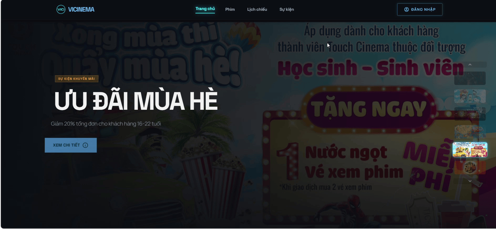

### Seat Status Real-time Update
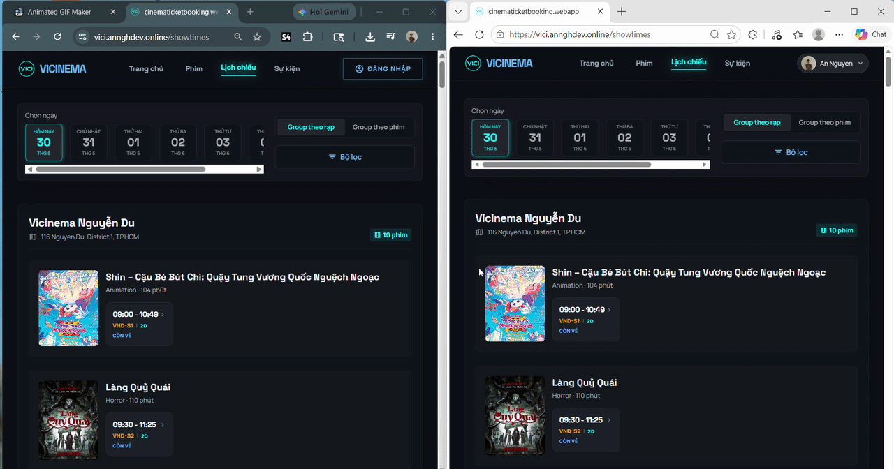

### Admin Portal (ASP.NET Core MVC)

**Admin Dashboard**
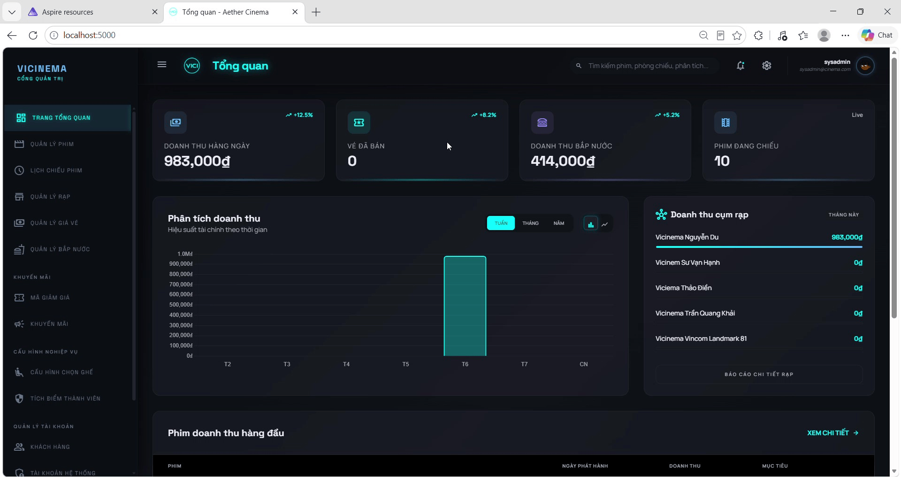

**Showtime Scheduling**
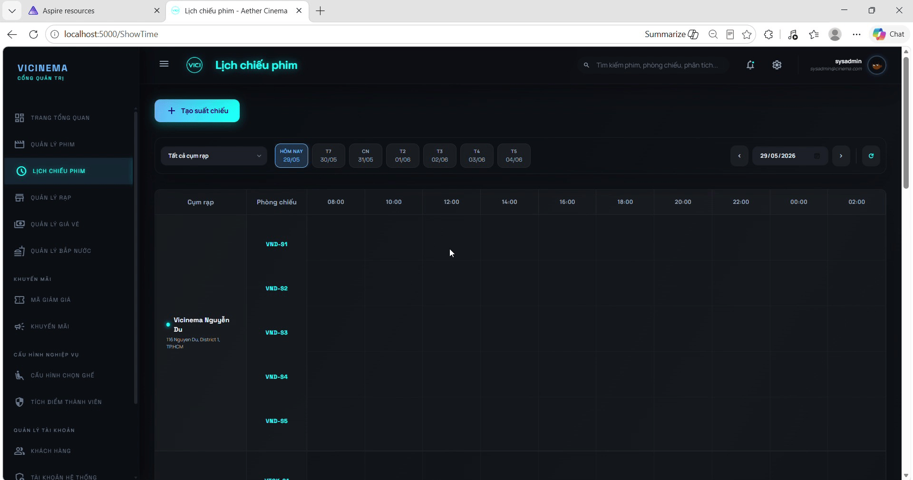

**Coupon Management**
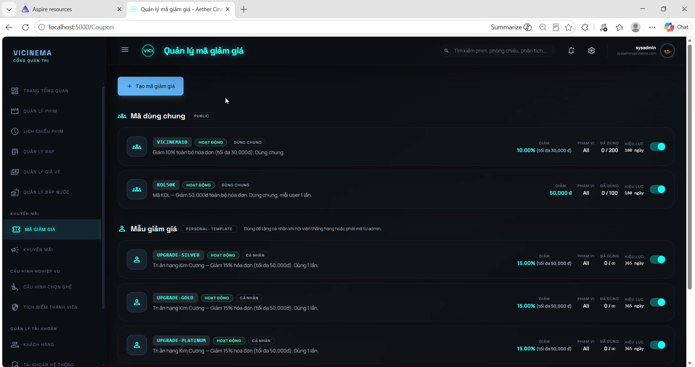

**Seat Selection Rules Configuration**
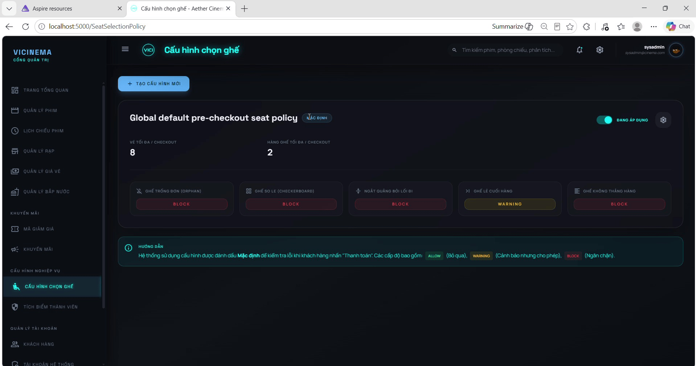

**Access Control / Permissions Matrix**
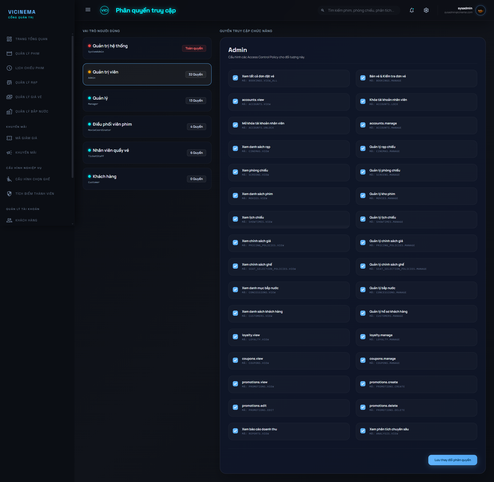

### Observability & Monitoring
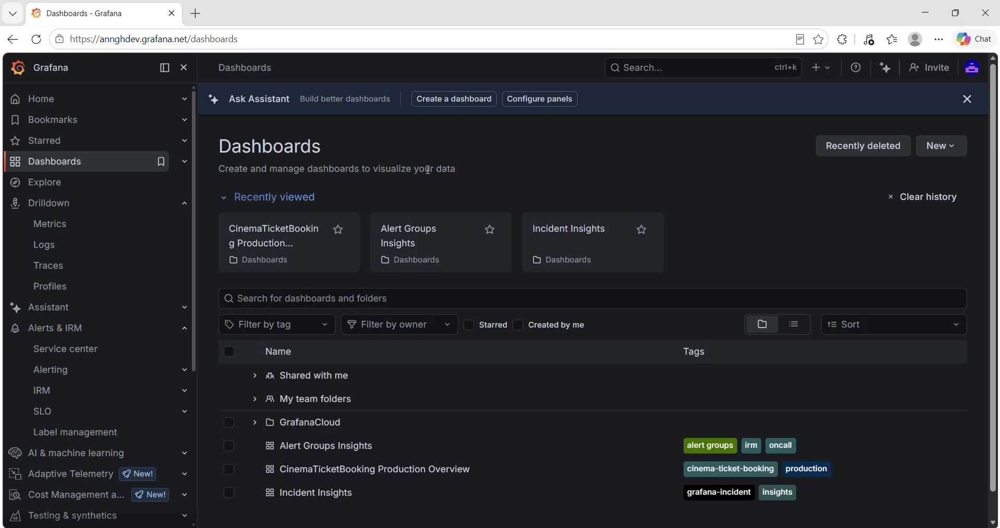

### Aspire Dashboard (Support tool for local development environment)
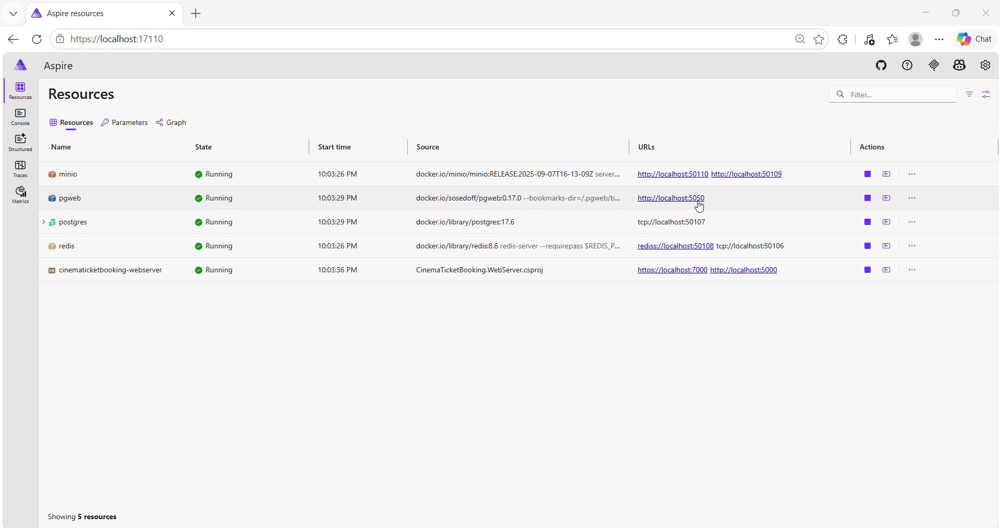

### Interactive API Docs - Test APIs directly in the browser (Scalar)
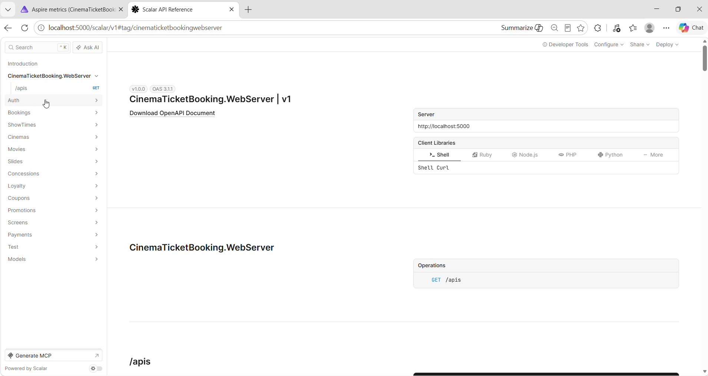

---

## Contact

- **Name:**  `Nguyễn Hữu An`
- **Email:**  `annghdev@gmail.com`
- **Phone/Zalo:** `0867 662 945`

---

## License

This project is licensed under the [MIT License](LICENSE.txt).

```
//                                               _oo0oo_
//                                              o8888888o
//                                              88" . "88
//                                              (| -_- |)
//                                              0\  =  /0
//                                            ___/`---'\___
//                                          .' \\|     |// '.
//                                         / \\|||  :  |||// \
//                                        / _||||| -:- |||||- \
//                                       |   | \\\  -  /// |   |
//                                       | \_|  ''\---/''  |_/ |
//                                       \  .-\__  '-'  ___/-. /
//                                     ___'. .'  /--.--\  `. .'___
//                                  ."" '<  `.___\_<|>_/___.' >' "".
//                                 | | :  `- \`.;`\ _ /`;.`/ - ` : | |
//                                 \  \ `_.   \_ __\ /__ _/   .-` /  /
//                              ====`-.____`.___ \_____/___.-`___.-'=====
//                                               `=---='
//                             ~~~~~~~~~~~~~~~~~~~~~~~~~~~~~~~~~~~~~~~~~~~
//                                ~ Phật Tổ phù hộ - Không bao giờ Bug ~
//                             ~~~~~~~~~~~~~~~~~~~~~~~~~~~~~~~~~~~~~~~~~~~
```
