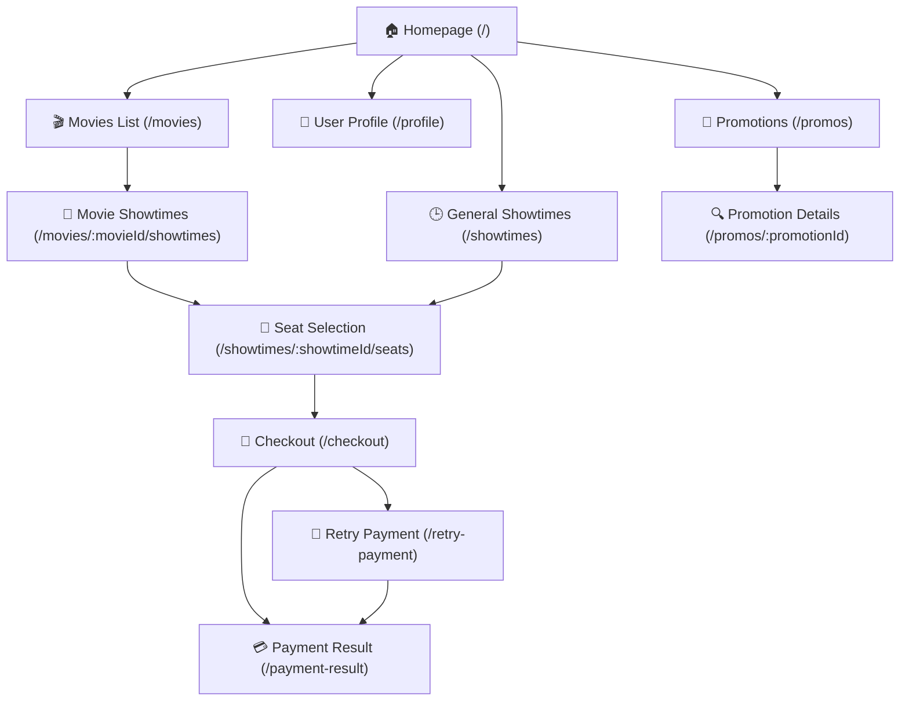

# Cinema Ticket Booking Project Summary Report (28/06/2026)

This document provides a detailed summary of the architectural structure of the Cinema Ticket Booking project, built according to the **Clean Architecture** pattern combined with **CQRS** (using Wolverine as the Message Bus) and **Minimal APIs + MVC Controllers** in ASP.NET Core (.NET 10).

---

## 1. Domain Layer (CinemaTicketBooking.Domain)

The Domain layer contains all the core business logic, business rules, entities, repository interfaces, and domain services.

### 📊 Statistical Summary
*   **Total Entities**: `20` entities.
*   **Total Repositories**: `17` repository interfaces.
*   **Total Domain Services**: `22` source files serving business calculations and validations (including seat selection rules).

---

### 📂 Detailed List of Entities & Aggregate Classification

The system clearly distinguishes between **Aggregate Roots** (the root entity of an Aggregate) and associated or dependent entities:

#### 🔹 List of 15 Aggregates (Aggregate Roots)
Entities inheriting from the `AggregateRoot` base class:

| No. | Aggregate Root | File | Description |
| :--- | :--- | :--- | :--- |
| 1 | **Booking** | `Booking.cs` | Manages booking information, payment status, and customer details. |
| 2 | **Cinema** | `Cinema.cs` | Manages cinemas, their names, and geographic locations. |
| 3 | **Concession** | `Concession.cs` | Manages concession items (popcorn, drinks) and their availability. |
| 4 | **CouponTemplate** | `CouponTemplate.cs` | Manages coupon templates, expiration dates, and discount types. |
| 5 | **Customer** | `Customer.cs` | Manages customer account details and loyalty reward points. |
| 6 | **CustomerCoupon** | `CustomerCoupon.cs` | Manages coupons issued to each customer and their usage status. |
| 7 | **LoyaltyTierConfiguration** | `LoyaltyTierConfiguration.cs` | Configures loyalty membership tiers (Silver, Gold, Platinum, etc.). |
| 8 | **Movie** | `Movie.cs` | Manages movies, genres, duration, directors, and screening status. |
| 9 | **PricingPolicy** | `PricingPolicy.cs` | Defines ticket pricing policies based on showtime, seat type, or holidays. |
| 10 | **PromotionProgram** | `PromotionProgram.cs` | Manages major promotional campaigns applied to bookings. |
| 11 | **Screen** | `Screen.cs` | Manages auditoriums (screens) and the seat layout in each auditorium. |
| 12 | **SeatSelectionPolicy** | `SeatSelectionPolicy.cs` | Defines policies to validate seat layout selections (e.g., preventing leaving single empty seats). |
| 13 | **ShowTime** | `ShowTime.cs` | Movie screening schedules, managing which movie is shown in which screen and at what time slot. |
| 14 | **Slide** | `Slide.cs` | Manages promotional banners and featured movie slide images on the homepage. |
| 15 | **Ticket** | `Ticket.cs` | Manages seat booking information for showtimes, ticket prices, and locking/selling seat status. |

#### 🔸 Other Dependent Entities (Normal Entities)
Entities serving many-to-many (n-n) relationships or supporting aggregate information:
*   `BookingPromotion.cs` (Many-to-many relationship table between Bookings and Promotions)
*   `CustomerPromotionUsage.cs` (Tracks customer usage of promotional programs)
*   `PaymentTransaction.cs` (Detailed payment transaction information)
*   `PromotionCondition.cs` (Conditions for applying promotional programs)
*   `PromotionFreeConcessionItem.cs` (Free concession items given under a promotion)

---

### 🏛️ Repository Interfaces
Interfaces defining database communication for the 17 core business entities:
1.  `IBookingRepository`
2.  `ICinemaRepository`
3.  `IConcessionRepository`
4.  `ICouponTemplateRepository`
5.  `ICustomerCouponRepository`
6.  `ICustomerPromotionUsageRepository`
7.  `ICustomerRepository`
8.  `ILoyaltyTierConfigurationRepository`
9.  `IMovieRepository`
10. `IPaymentTransactionRepository`
11. `IPricingPolicyRepository`
12. `IPromotionProgramRepository`
13. `IScreenRepository`
14. `ISeatSelectionPolicyRepository`
15. `IShowTimeRepository`
16. `ISlideRepository`
17. `ITicketRepository`

---

### ⚙️ Domain Services
Pure domain services handling logic that does not belong to a single entity:
*   **Discount Strategy System (Discount Strategies)**:
    *   `IDiscountStrategy`: Common interface for discount strategies.
    *   `DiscountStrategyComposite`: Aggregates and applies a combination of multiple strategies.
    *   `CouponDiscountStrategy`: Calculates discounts from coupons.
    *   `LoyaltyTierDiscountStrategy`: Calculates discounts based on customer loyalty tiers.
    *   `PromotionDiscountStrategy`: Calculates discounts from promotional programs.
    *   `ILoyaltyDiscountService` & `LoyaltyDiscountService`: Manages loyalty program benefits.
*   **Promotion Scan System**:
    *   `PromotionScanService`: Automatically searches and applies the most optimal promotion for a booking.
    *   `PromotionScanModels`: Data structures supporting promotional scanning.
*   **ShowTime Scheduling System**:
    *   `ShowTimeSchedulingService`: Checks for screen and time slot conflicts when scheduling a new showtime.
*   **Seat Selection Validator System**:
    *   `SeatSelectionValidator`, `SeatSelectionValidationContext`, `SeatSelectionValidationModels`
    *   **7 Seat Selection Rules** inheriting from `ISeatSelectionRule`:
        1.  `CheckerboardRule` (Checkerboard layout pattern rule)
        2.  `IsolatedRowEndSingleRule` (Rule to avoid leaving a single empty seat at the start/end of a row)
        3.  `MaxRowsPerCheckoutRule` (Rule limiting the number of rows selected per transaction)
        4.  `MaxTicketsPerCheckoutRule` (Limits the maximum number of tickets per booking)
        5.  `MisalignedRowsRule` (Rule checking alignment for misaligned rows of seats)
        6.  `OrphanSeatRule` (Rule preventing leaving a single isolated empty seat between selected seats)
        7.  `SplitAcrossAisleRule` (Rule checking if selected seats are split across an aisle)

---

## 2. Application Layer (CinemaTicketBooking.Application)

The Application layer contains the system's use cases, handles data flow using CQRS, and coordinates side effects via Wolverine Event Handlers.

### 📊 Statistical Summary
*   **Total Commands**: `52` commands (modify system state).
*   **Total Queries**: `50` queries (query data).
*   **Total Event Handlers**: `22` files containing `59` asynchronous domain event handler methods.

---

### 📂 Categorized by Aggregates / Features (18 Main Groups)

Use cases are organized systematically in the `Features` folder corresponding to business domains:

| Feature Name | Commands | Queries | Handling Content |
| :--- | :---: | :---: | :--- |
| **Accounts** | 6 | 2 | Registration, login, locking/unlocking accounts, changing/resetting passwords. |
| **Bookings** | 3 | 4 | Ticket booking, viewing booking history, canceling bookings, checking in tickets at the counter. |
| **Cinemas** | 3 | 4 | Adding, editing, deleting, and fetching list/details of cinemas. |
| **Concessions** | 4 | 4 | Concession items management, updating availability (in stock/out of stock). |
| **Coupons** | 2 | 4 | Creating coupon templates, activating/deactivating, looking up customer coupons, verifying validity. |
| **Files** | 1 | 0 | Uploading files to cloud storage (MinIO/S3). |
| **Loyalty** | 1 | 3 | Updating loyalty tiers, looking up accumulated points, and customer rankings. |
| **Movies** | 3 | 7 | Adding, editing, deleting movies, looking up now showing and upcoming movies. |
| **Payments** | 2 | 1 | Verifying payments via VNPay/MoMo gateways, retrying failed payments. |
| **PricingPolicies** | 4 | 4 | Managing pricing policies, activating/suspending policies. |
| **Promotions** | 4 | 2 | Creating, updating, deleting promotional campaigns, activating/pausing promotions. |
| **Screens** | 4 | 4 | Managing screens (auditoriums), seat layout configurations, activating/blocking specific seats. |
| **SeatSelectionPolicies** | 4 | 2 | Configuring seat selection validation rules for screens. |
| **ShowTimes** | 4 | 5 | Creating new showtimes, starting showtimes, closing showtimes, canceling showtimes. |
| **Slides** | 0 | 1 | Retrieving the list of promotional/banner images for the UI. |
| **Statistic** | 0 | 4 | Cinema revenue statistics, movie revenue statistics, overall admin dashboard overview. |
| **Tickets** | 7 | 0 | Temporarily locking seats, releasing expired seats, starting ticket payment process. |
| **Tests** | 1 | 0 | Supporting test email delivery for testing services. |
| **TOTAL** | **52** | **50** | |

---

### ⚡ Event Handlers (Background & Side-Effect Processing)

Wolverine Event Handlers listen to Domain Events dispatched from the Domain layer to execute critical background tasks (such as sending emails, invalidating Redis cache, accumulating loyalty points, etc.):

*   **Automatic Cache Invalidation**: When data changes, the system immediately clears the Redis cache to optimize read speeds for subsequent requests.
    *   `CinemaCacheInvalidationHandler` (5 events)
    *   `ConcessionCacheInvalidationHandler` (5 events)
    *   `CouponCacheInvalidationHandler` (2 events)
    *   `LoyaltyCacheInvalidationHandler` (1 event)
    *   `MovieCacheInvalidationHandler` (6 events)
    *   `PricingPolicyCacheInvalidationHandler` (3 events)
    *   `PromotionCacheInvalidationHandler` (5 events)
    *   `ScreenCacheInvalidationHandler` (7 events)
    *   `SeatSelectionPolicyCacheInvalidationHandler` (3 events)
    *   `ShowTimeCacheInvalidationHandler` (4 events)
    *   `SlideCacheInvalidationHandler` (3 events)
*   **Billing & Booking Operations**:
    *   `BookingConfirmedHandlers`: Automatically sends a booking confirmation email with a secure QR code (via Brevo Email Sender) upon receiving the `BookingConfirmed` event.
*   **Customer Care & Loyalty**:
    *   `LoyaltyPointsAccumulationHandler`: Listens to the `BookingConfirmed` event to automatically award loyalty points to the customer.
    *   `LoyaltyTierUpgradedEmailHandler`: Listens to the `LoyaltyTierUpgraded` event to send a congratulatory email for a membership upgrade.
    *   `CouponUsageTrackingHandler`: Tracks usage metrics when a coupon is successfully applied.
*   **Showtime Operations**:
    *   `ShowtimeCreatedHandlers`: Initializes the starting status for all auditorium seats as soon as a `ShowTime` is scheduled.
    *   `ShowtimeStartedHandlers`: Automatically updates screen status and pushes SignalR updates when a showtime starts.
*   **Real-time Seat & Ticket State Management**:
    *   `TicketLockedHandlers`: Broadcasts locked seat states via SignalR to all clients to prevent other users from selecting the same seats.
    *   `TicketPendingPaymentHandlers`: Reserves seats and marks them as pending payment for 5-10 minutes.
    *   `TicketReleasedHandler`: Immediately releases seats when the payment window expires or the user deselects them.
    *   `TicketSoldHandler`: Marks seats as permanently sold after a successful payment transaction.

### 🔀 Wolverine Behavior Pipelines (Message Pipelines)

The application configures Wolverine Policies to automatically intercept the lifecycle of message handling (Commands/Queries) via a middleware pipeline, eliminating boilerplate code:

1.  **Fluent Validation Middleware (`opts.UseFluentValidation()`)**:
    *   Automatically detects and runs all corresponding `AbstractValidator<T>` rules for incoming Commands or Queries. If validation fails, the pipeline halts processing and immediately throws a validation error.
2.  **Transaction Middleware (`CommandTransactionPolicy` & `opts.UseEntityFrameworkCoreTransactions()`)**:
    *   A custom policy applied automatically to all `ICommand` message handlers. Wolverine automatically opens a connection, initializes an EF Core Transaction, automatically saves changes (`SaveChangesAsync`), and commits the transaction on success, or rolls it back if an exception occurs. Query handlers are bypassed to maintain optimal performance.
3.  **Correlation ID Propagation (`CorrelationIdWolverineMiddleware`)**:
    *   Automatically links and propagates the correlation ID from the current HTTP Request's `ICorrelationIdAccessor` into Wolverine message headers for seamless cross-layer trace logging.
4.  **Logging Pipeline (`LoggingMiddleware`)**:
    *   Automatically logs incoming messages, returned results, and measures the exact execution duration of each Command/Query.
5.  **Query Caching Middleware (`CachingMiddleware`)**:
    *   Automatically applied to query messages implementing the `ICachableQuery` marker interface. It caches and retrieves results rapidly from Redis without hitting the database for duplicate requests.
6.  **Outbox Pattern & Durable Queues (`opts.UseDurableLocalQueues()`)**:
    *   Integrates Wolverine's PostgreSQL Message Store to ensure durable queue reliability. Specifically, the `"domain_events"` queue runs in durable mode (Durable Inbox) to ensure no domain events are lost even if the system crashes midway.
7.  **Concurrency Retry Policies**:
    *   Automatically catches concurrent data conflicts (`ConcurrencyException` and `DbUpdateConcurrencyException`) to perform a **Retry with cooldown** after 50ms, 250ms, and up to 1s before pushing to the Error Queue (Poison queue) upon complete failure.

---

## 3. Infrastructure Layer (CinemaTicketBooking.Infrastructure)

The Infrastructure layer is responsible for implementing the interfaces defined in the inner layers, managing database connections and sessions, and integrating with external services (Payment Gateways, Cloud Storage, Mailers, Redis Cache).

### 📊 Statistical Summary
*   **Total Source Files**: `92` files (including configurations, migrations, and services).
*   **Number of Integrated External Services**: `5` services (Redis, MinIO, Brevo Mail, VNPay, MoMo).
*   **Number of EF Core Entity Configuration Classes (Configurations)**: `28` detailed table mapping configuration classes.
*   **Number of Repository Implementations**: `18` classes (including the generic `BaseRepository` and 17 concrete repositories).

---

### 📂 Details of Integrated Components & Operations

The Infrastructure architecture is modularized into highly distinct, specialized components:

#### 🔐 1. Authentication & Identity (`Auth/`)
*   **ASP.NET Core Identity**: Implements user account management, role authorization, and password hashing via `IdentityAuthService.cs`, and seeds default system accounts via `IdentityDataSeeder.cs`.
*   **JWT & Refresh Tokens Configuration**: Configures expiration durations and secure digital signatures for Access and Refresh Tokens via `JwtOptions.cs` and `RefreshTokenOptions.cs` to prevent session hijacking vulnerabilities.
*   **Context Extraction System (User Context)**:
    *   `HttpUserContext.cs`: Automatically extracts UserId, Email, Roles, and CorrelationId from the headers of the current HTTP request.
    *   `SystemUserContext.cs`: Provides a simulated/automatic system identity when running CronJobs or background tasks (Background Services).

#### ⚡ 2. Caching & Distributed Lock (`Cache/`)
*   **Redis Caching**: `RedisCacheService.cs` caches less frequently changing data such as cinema lists, screens, ticket prices, and movie configurations to optimize response performance.
*   **Real-Time Seat Locking (Ticket Locker)**:
    *   `TicketLocker.cs`: Uses Redis Distributed Locks to perform temporary seat reservations (Ticket Lock) while users are selecting seats. This mechanism operates with a strict Time-to-Live (TTL) of 5-10 minutes to guarantee that no two users can select the same seats before checkout is completed.
*   **No-Op Fallback**: `NoOpCacheService.cs` activates automatically if Redis is down or unavailable in development environments, allowing the system to degrade gracefully without crashing.

#### 📦 3. File Storage (`FileStorages/`)
*   **S3 / MinIO Integration**: `MinioFileStorageService.cs` connects to the MinIO cloud object storage service (in development) or AWS S3 (in production) to manage the uploading, downloading, and deletion of static resources like movie covers, posters, and banner images.

#### ✉️ 4. Notifications & Email (`Notifications/`)
*   **Brevo Email API**: `BrevoEmailSender.cs` connects directly to Brevo SMTP/API to send booking confirmation emails containing detailed HTML invoices or password reset support emails.
*   **Log Fallback**: `LogEmailSender.cs` serves local development environments; instead of sending costly real emails, the system simply writes the email content to the console or log files.

#### 💳 5. Online Payment Gateways (`Payments/`)
*   **Payment Coordination**: `PaymentServiceFactory.cs` acts as a factory to automatically resolve and route the appropriate payment service based on the customer's choice.
*   **VNPay & MoMo Implementations**:
    *   `VnpayPaymentService.cs` & `VnpayHashing.cs`: Handles generating secure hashing signatures, building payment redirect URLs to the VNPay gateway, and processing Instant Payment Notifications (IPN) and Return URLs to update invoices.
    *   `MomoPaymentService.cs` & `MomoSigning.cs`: Handles RSA-SHA256 security signatures and API payment communication with the MoMo wallet.
*   **Mocks**: `NoPaymentGatewayService.cs` simulates successful/failed payment flows instantly to support automated integration testing without requiring internet access.

#### 🏛️ 6. Data Persistence & ORM (`Persistence/`)
*   **DbContext & Factory**: `AppDbContext.cs` is the backbone connecting EF Core ORM with the PostgreSQL database. `AppDbContextFactory.cs` supports running EF Core CLI tools for generating migrations.
*   **Automatic UTC Standardization**: `UtcSaveChangesInterceptor.cs` automatically intercepts data saving operations to force all `DateTimeOffset` properties to the international UTC standard before saving to Postgres, resolving timezone discrepancies.
*   **Dapper Integration**: `QueryService.cs` integrates the lightweight Dapper library to execute raw SQL queries for optimizing large-scale reporting queries (such as theater revenues or growth charts).
*   **28 Entity Configuration Classes**: Located in the `Configurations/` folder, these classes define database schema constraints in detail (e.g., maximum string lengths via `MaxLengthConsts`, composite primary keys, cascade delete behaviors, and index optimizations for fast searches).
*   **18 Repository Implementations**: Located in the `Repositories/` folder, these implement CRUD operations and query data fetching details for the 17 Aggregate Roots from the Domain layer.
*   **EF Core Migrations**: Manages database schema history with 7 Migration files (including `20260522174650_InitDb`, `20260523221036_AddPromotionFeature`, `20260523223012_AddCustomerDateOfBirthAndGender`, and the current snapshot).

#### 🖨️ 7. QR Code Generation (`QrCodes/`)
*   **QrCodeGenerator**: Utilizes a library to generate QR code images containing secure encrypted booking and ticket IDs, allowing ticket staff at the counter to scan the customer's phone to verify ticket validity instantly.

---

## 4A. Presentation Layer (CinemaTicketBooking.WebServer)

The Presentation layer handles direct communication with the external environment via HTTP REST APIs and the Admin MVC Management Portal.

### 📊 Statistical Summary of API Endpoints (Minimal APIs)
*   **Total Endpoints**: `100` APIs (structured across 15 files corresponding to core business features for the ReactJS Client).
*   **Total MVC Controllers (Admin)**: `14` Controllers (used for internal system administration web interface).

---

### 📂 API Endpoints Classification by Aggregates (15 Endpoint Files)

| API Endpoint File | Endpoint Count | Core APIs |
| :--- | :---: | :--- |
| **AuthEndpoints.cs** | `15` | Register, Login, Logout, Refresh token, Get profile, Forgot/Change password, Social login (Google, Facebook), Lock/Unlock Admin accounts. |
| **BookingEndpoints.cs** | `7` | Get booking details, Booking history, Pricing preview, Initiate booking, Ticket check-in, Cancel booking, Retry payment. |
| **CinemaEndpoints.cs** | `7` | Get cinemas, Paginated search, Cinema dropdown, Add cinema, Update cinema, Delete cinema. |
| **ConcessionEndpoints.cs** | `9` | Concessions list, Concessions pagination, Concessions dropdown, Add/Edit/Delete concessions, Change availability. |
| **CouponEndpoints.cs** | `3` | Get my coupons, Get public coupons, Verify coupon validity before application. |
| **LoyaltyEndpoints.cs** | `2` | Look up loyalty points, Get active loyalty tier configurations. |
| **MovieEndpoints.cs** | `9` | Movies list, Movies pagination, Movies dropdown, Get now playing/upcoming movies, Movie details, Add/Edit/Delete movies. |
| **PaymentEndpoints.cs** | `7` | VNPay integration (IPN, Return), MoMo integration (IPN, Return), Mock callbacks, Get payment results, Get available payment gateways. |
| **PricingPolicyEndpoints.cs** | `9` | Pricing policies list, Pagination, Dropdown, Policy details, Add/Edit/Delete policy, Activate/Deactivate policy. |
| **PromotionEndpoints.cs** | `2` | Get active promotions list, Get promotion details. |
| **ScreenEndpoints.cs** | `10` | Screens list, Pagination, Dropdown, Add/Edit screen, Activate/Deactivate screen, Toggle active status for specific seats. |
| **SeatSelectionPolicyEndpoints.cs** | `6` | Seat policies list, Policy details, Add/Update policy, Activate/Deactivate seat selection policy. |
| **ShowTimeEndpoints.cs** | `11` | Showtimes list, Pagination, Dropdown, Add showtime, Start/Complete/Cancel showtime, Lock/Release seats, Validate selected seats. |
| **SlideEndpoints.cs** | `1` | Get home slides/banners. |
| **TestEndpoints.cs** | `1` | Test email confirmation sending endpoint. |
| **TOTAL** | **100** | |

---

### 📡 SignalR Hubs (Real-Time Communication)

The WebServer implements SignalR technology to build dynamic, duplex real-time communication channels between Client and Server:

1.  **TicketStatusHub (`/hubs/ticketStatus`)**:
    *   **Functionality**: Manages seat locking and releasing states in the box office. When a customer clicks a seat, the client calls the seat-locking API, and SignalR broadcasts a `TicketLocked` or `TicketReleased` event to all other clients viewing the same showtime group (`ShowTimeId` group) to dynamically update seat colors and prevent double-booking.
    *   **Publisher**: `SignalRTicketRealtimePublisher.cs` (implements the `ITicketRealtimePublisher` interface).
2.  **PaymentHub (`/hubs/paymentStatus`)**:
    *   **Functionality**: Tracks the payment progress of a specific booking. When the third-party payment gateway (VNPay, MoMo) returns an IPN callback to the server and the invoice is verified, the PaymentHub immediately pushes `PaymentCompleted` or `PaymentFailed` states to the client's browser waiting on the result screen (`BookingId` group).
    *   **Publisher**: `SignalRPaymentRealtimePublisher.cs` (implements the `IPaymentRealtimePublisher` interface).

---

### 🛡️ WebServer Middlewares (HTTP Intermediate Layers)

The WebServer's HTTP Request Pipeline is protected and optimized via custom middlewares:

1.  **CorrelationIdMiddleware**:
    *   Automatically extracts the Correlation-ID from the Request Header (if present) or generates a new one using `Guid.CreateVersion7().ToString()` and saves it in the scoped `CorrelationIdAccessor`. This ID is subsequently attached to all logs (Serilog) and Wolverine message headers for end-to-end trace tracking.
2.  **GlobalExceptionMiddleware**:
    *   A global exception handler. It wraps the entire HTTP request pipeline; if any unhandled exception occurs, it logs details along with the CorrelationId and returns a standard RFC 7807 **Problem Details** error response to the client (e.g., `ApplicationException` -> 400 Bad Request, unexpected system errors -> 500 Internal Server Error).
3.  **ASP.NET Core Rate Limiting Middleware**:
    *   Registered via `builder.Services.AddRateLimiter` to limit the maximum number of requests from a single IP address (Fixed Window) to prevent Denial of Service (DoS/DDoS) attacks on sensitive endpoints.

---

### ⏰ Cron Jobs & Background Services (Periodic Background Tasks)

The system integrates background Hosted Services to automate routine operations without manual intervention:

1.  **TicketLockRecoveryHostedService**:
    *   **Frequency**: Runs periodically once every minute.
    *   **Functionality**: Scans the database and Redis for tickets in a temporarily locked state (`Locked` or `PendingPayment`) that have exceeded their reservation window (e.g., exceeding 10 minutes because the customer closed the browser or abandoned checkout). The service automatically dispatches a `RecoverStaleTicketLocksCommand` to release these seats back to available status.
2.  **AutoSheduleShowtimesDailyService**:
    *   **Frequency**: Runs in the background daily at 1:00 AM.
    *   **Functionality**: (Development demo) Automatically triggers movie scheduling for the following day. It scans active movies, checks screen availability, and coordinates with `ShowTimeSchedulingService` to automatically generate new `ShowTime` records in the database, ensuring showtimes are populated every day.

---

### 🖥️ List of MVC Controllers (Serving Admin UI Management)
The system utilizes MVC Controllers returning Razor Views paired with AJAX and jQuery for the internal management interface used by staff and administrators:
1.  `AuthController`: Manages sessions and logins to the admin portal.
2.  `CinemaController`: Manages cinema clusters and geography.
3.  `ConcessionController`: Manages concession inventory (popcorn, drinks) across cinemas.
4.  `CouponController`: Configures discount coupon campaigns.
5.  `HomeController`: Dashboard rendering general growth and revenue charts.
6.  `LoyaltyController`: Configures points accumulation rules and membership tier perks.
7.  `MovieController`: Manages movie information, descriptions, and showtime availability.
8.  `PricingController`: Adjusts flexible ticket pricing tables based on day, hour, and seat type.
9.  `PromotionController`: Configures marketing and promotional programs.
10. `RoleController`: Manages roles and permissions for employees.
11. `ScreenController`: Sets up screening auditoriums and maps seat layouts.
12. `SeatSelectionPolicyController`: Toggles client-side online seat selection validation rules.
13. `ShowTimeController`: Coordinates daily movie scheduling for cinemas.
14. `UserManagementController`: Manages user accounts, customer profiles, and staff profiles.

---

## 4B. Frontend ReactJS SPA (CinemaTicketBooking.WebApp)

The Frontend layer is developed using **ReactJS** with **TypeScript** and **TailwindCSS**, serving as the Client UI where customers can book tickets online, look up showtimes, view member reward points, and checkout securely.

### 📊 Statistical Summary
*   **Total Screens (Pages)**: `14` active pages (and 1 placeholder file `CinemaWithShowtimes.tsx`).
*   **Number of API Modules (Services)**: `14` specialized API service files (Auth, Booking, Cinema, Concession, Coupon, Loyalty, Movie, Payment, PaymentRealtime, Promotion, Showtime, Slide, TicketRealtime, HttpClient).
*   **Number of Real-Time Communication Channels (SignalR Hubs)**: `2` core synchronization hubs (Seat locking & Payment status).

---

### 🗺️ Sitemap (Website Navigation Map)

The route mapping structures (Sitemap) are strictly defined in `App.tsx` navigation configuration:

---

### 📡 Detailed API Calls per Page (Page API Consumption)

Below is the detailed list of backend endpoints consumed by each screen to maintain application state:

| No. | Screen & Route | Main Functionality | Backend Endpoints Called | Hooks Used |
| :--- | :--- | :--- | :--- | :--- |
| 1 | **Homepage** `/` | Welcomes customers, displays dynamic slide banners, Now Showing / Upcoming movie lists, and quick-filter showtimes by cinema. | `GET /api/slides` `GET /api/movies/upcoming-now-showing` `GET /api/cinemas` | `useState`, `useEffect` |
| 2 | **Movies List** `/movies` | Displays all Now Showing/Upcoming movies in tabbed lists, supporting searches, genre filtering, and quick showtime listings. | `GET /api/movies/upcoming-now-showing` `GET /api/showtimes` | `useState`, `useEffect`, `useMemo` |
| 3 | **Movie Showtimes** `/movies/:movieId/showtimes` | Displays movie details (poster, trailer, description) and its screening schedules across all cinema clusters grouped by date. | `GET /api/movies/{movieId}` `GET /api/showtimes?movieId={movieId}` | `useState`, `useEffect`, `useParams`, `useToast`, `useMemo`, `useCallback` |
| 4 | **General Showtimes** `/showtimes` | General showtimes lookup across the entire theater system based on selected cinema and date. | `GET /api/cinemas` `GET /api/movies` `GET /api/showtimes` | `useState`, `useEffect`, `useToast`, `useMemo` |
| 5 | **Real-time Seat Selection** `/showtimes/:showtimeId/seats` | Seat layout selection diagram, displaying real-time available, sold, and locked seat states. Supports select/deselect and seat layout validation. | `GET /api/showtimes/{id}` `POST /api/showtimes/{id}/tickets/{ticketId}/lock` `POST /api/showtimes/{id}/tickets/{ticketId}/release` `POST /api/showtimes/{id}/validate-seat-selection` **SignalR**: `/hubs/ticketStatus` | `useState`, `useEffect`, `useNavigate`, `useToast`, `useParams`, `useRef`, `useMemo` |
| 6 | **Checkout** `/checkout` | Booking confirmation, purchasing concession items, checking personal coupons, verifying coupons, previewing pricing, initiating booking, and routing payment gateways. | `GET /api/showtimes/{id}` `GET /api/concessions` `GET /api/promotions/active` `GET /api/coupons/my-coupons` `POST /api/coupons/verify` `POST /api/bookings/preview-pricing` `POST /api/bookings` `GET /api/payments/gateways` `GET /api/payments/fake-callback` **SignalR**: `/hubs/paymentStatus` | `useState`, `useEffect`, `useCallback`, `useNavigate`, `useAuth`, `useToast`, `useMemo`, `useRef` |
| 7 | **Payment Result** `/payment-result` | Displays payment results redirected from external gateways, prints ticket invoices with a secure QR code for in-theater check-in. | `GET /api/bookings/{bookingId}` `GET /api/payments/result` | `useState`, `useEffect`, `useCallback`, `useNavigate`, `useAuth`, `useMemo` |
| 8 | **Retry Payment** `/retry-payment` | Supports retrying failed/canceled payments for existing orders without needing to reselect seats, or canceling old bookings. | `GET /api/bookings/{bookingId}` `GET /api/payments/gateways` `POST /api/bookings/{bookingId}/retry-payment` `PUT /api/bookings/{bookingId}/cancel` `GET /api/payments/fake-callback` **SignalR**: `/hubs/paymentStatus` | `useState`, `useEffect`, `useCallback`, `useNavigate`, `useToast` |
| 9 | **User Profile & History** `/profile` | Manages user profile info, passwords, loyalty point balances, coupon wallets, and detailed ticket booking histories. | `GET /api/loyalty/me` `GET /api/loyalty/tiers` `GET /api/coupons/my-coupons` `GET /api/bookings/history/{customerId}` `POST /api/auth/change-password` | `useState`, `useEffect`, `useAuth`, `useToast`, `useMemo` |
| 10 | **Member Benefits** `/member` | Static page introducing loyalty reward points system, membership tiers, and flat-rate student pricing. | *None (Static Page)* | None (Static Page) |
| 11 | **Promotions List** `/promos` | Summary of all active promotional campaigns and theater news across the network. | `GET /api/promotions/active` | `useState`, `useEffect`, `useMemo` |
| 12 | **Promotion Details** `/promos/:promotionId` | Displays terms, details, and active dates for a specific promotion event. | `GET /api/promotions/{id}` | `useState`, `useEffect`, `useCallback`, `useNavigate`, `useToast`, `useParams`, `useRef` |
| 13 | **Social Auth Callback** `/auth-callback` | Handles Google/Facebook login tokens returned from the backend and manages routing redirection. | *None* | `useEffect`, `useNavigate`, `useAuth`, `useToast`, `useRef` |
| 14 | **User Account Popup** `(AuthModal Component)` | Global shared modal for User Login, Registration, Forgot Password, and Logout (Header). | `POST /api/auth/login` `POST /api/auth/register` `POST /api/auth/forgot-password` `POST /api/auth/logout` | `useState`, `useAuth`, `useToast` |

---
*\*This report was compiled based on the analysis of the project's actual source code structure as of June 28, 2026.*
