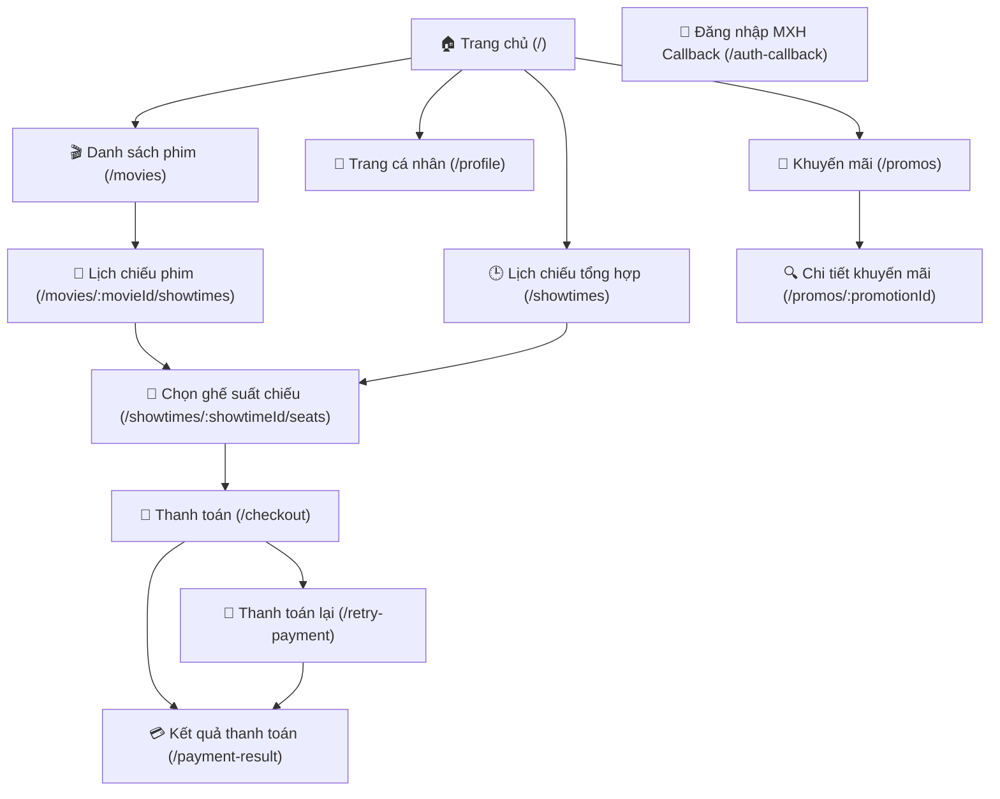

# Báo Cáo Tổng Hợp Dự Án Cinema Ticket Booking (28/06/2026)

Tài liệu này tổng hợp chi tiết cấu trúc kiến trúc của dự án Cinema Ticket Booking, được xây dựng theo mô hình **Clean Architecture** kết hợp với **CQRS** (sử dụng Wolverine làm Message Bus) và **Minimal APIs + MVC Controllers** trong ASP.NET Core (.NET 10).

---

## 1. Domain Layer (CinemaTicketBooking.Domain)

Tầng Domain chứa toàn bộ core business logic, các quy tắc nghiệp vụ, thực thể (Entities), giao diện Repository và các dịch vụ nghiệp vụ (Domain Services).

### 📊 Thống Kê Số Lượng
*   **Tổng số Entities**: `20` thực thể.
*   **Tổng số Repositories**: `17` giao diện repositories (interfaces).
*   **Tổng số Domain Services**: `22` files mã nguồn phục vụ tính toán và xác thực nghiệp vụ (gồm cả các quy tắc chọn ghế).

---

### 📂 Danh Sách Chi Tiết Thực Thể (Entities) & Phân Loại Aggregates

Hệ thống phân định rõ ràng giữa **Aggregate Root** (Thực thể gốc của Aggregate) và các thực thể liên kết hoặc thực thể phụ thuộc:

#### 🔹 Danh Sách 15 Aggregates (Aggregate Roots)
Các thực thể kế thừa từ lớp cơ sở `AggregateRoot`:

| STT | Tên Aggregate Root | File | Mô tả |
| :--- | :--- | :--- | :--- |
| 1 | **Booking** | `Booking.cs` | Quản lý thông tin đặt vé, trạng thái thanh toán và thông tin khách hàng. |
| 2 | **Cinema** | `Cinema.cs` | Quản lý rạp chiếu phim, tên và vị trí địa lý. |
| 3 | **Concession** | `Concession.cs` | Quản lý đồ ăn/thức uống đi kèm (bắp nước) và tính khả dụng của chúng. |
| 4 | **CouponTemplate** | `CouponTemplate.cs` | Quản lý mẫu coupon giảm giá, hạn sử dụng và loại giảm giá. |
| 5 | **Customer** | `Customer.cs` | Quản lý thông tin tài khoản khách hàng, điểm tích lũy thành viên. |
| 6 | **CustomerCoupon** | `CustomerCoupon.cs` | Quản lý coupon đã cấp cho từng khách hàng và trạng thái sử dụng. |
| 7 | **LoyaltyTierConfiguration** | `LoyaltyTierConfiguration.cs` | Định cấu hình phân hạng thành viên thân thiết (Silver, Gold, Platinum...). |
| 8 | **Movie** | `Movie.cs` | Quản lý phim, thể loại, thời lượng, đạo diễn và trạng thái chiếu phim. |
| 9 | **PricingPolicy** | `PricingPolicy.cs` | Định nghĩa các chính sách giá vé dựa trên thời gian chiếu, loại ghế hoặc ngày lễ. |
| 10 | **PromotionProgram** | `PromotionProgram.cs` | Quản lý các chiến dịch khuyến mãi lớn áp dụng cho đặt vé. |
| 11 | **Screen** | `Screen.cs` | Quản lý phòng chiếu phim và danh sách ghế ngồi trong phòng chiếu. |
| 12 | **SeatSelectionPolicy** | `SeatSelectionPolicy.cs` | Định nghĩa chính sách xác thực sơ đồ ghế khi chọn (chống để trống ghế đơn lẻ). |
| 13 | **ShowTime** | `ShowTime.cs` | Lịch chiếu phim, quản lý phim nào chiếu ở phòng nào, khung giờ nào. |
| 14 | **Slide** | `Slide.cs` | Quản lý các hình ảnh banners quảng cáo/phim nổi bật trên trang chủ. |
| 15 | **Ticket** | `Ticket.cs` | Quản lý thông tin ghế được đặt cho show diễn, giá vé và trạng thái khóa/bán ghế. |

#### 🔸 Các Thực Thể Phụ Thuộc Khác (Normal Entities)
Các thực thể phục vụ quan hệ liên kết n-n hoặc hỗ trợ bổ trợ thông tin trong các Aggregates:
*   `BookingPromotion.cs` (Bảng liên kết n-n giữa Đơn đặt vé và Chương trình Khuyến mãi)
*   `CustomerPromotionUsage.cs` (Theo dõi lượt sử dụng chương trình khuyến mãi của khách hàng)
*   `PaymentTransaction.cs` (Thông tin chi tiết về các giao dịch thanh toán)
*   `PromotionCondition.cs` (Điều kiện áp dụng chương trình khuyến mãi)
*   `PromotionFreeConcessionItem.cs` (Bắp nước tặng kèm theo chương trình khuyến mãi)

---

### 🏛️ Giao Diện Repositories
Các Interface định nghĩa giao tiếp với cơ sở dữ liệu cho 17 thực thể nghiệp vụ chính:
1.  `IBookingRepository`
2.  `ICinemaRepository`
3.  `IConcessionRepository`
4.  `ICouponTemplateRepository`
5.  `ICustomerCouponRepository`
6.  `ICustomerPromotionUsageRepository`
7.  `ICustomerRepository`
8.  `ILoyaltyTierConfigurationRepository`
9.  `IMovieRepository`
10. `IPaymentTransactionRepository`
11. `IPricingPolicyRepository`
12. `IPromotionProgramRepository`
13. `IScreenRepository`
14. `ISeatSelectionPolicyRepository`
15. `IShowTimeRepository`
16. `ISlideRepository`
17. `ITicketRepository`

---

### ⚙️ Domain Services
Các dịch vụ xử lý logic thuần túy không thuộc về riêng lẻ một thực thể nào:
*   **Hệ thống chiến lược giảm giá (Discount Strategies)**:
    *   `IDiscountStrategy`: Interface chung cho chiến lược giảm giá.
    *   `DiscountStrategyComposite`: Tổng hợp và áp dụng kết hợp nhiều chiến lược.
    *   `CouponDiscountStrategy`: Tính giảm giá từ Coupon.
    *   `LoyaltyTierDiscountStrategy`: Tính giảm giá từ phân hạng thành viên.
    *   `PromotionDiscountStrategy`: Tính giảm giá từ Chương trình khuyến mãi.
    *   `ILoyaltyDiscountService` & `LoyaltyDiscountService`: Quản lý các chương trình ưu đãi Loyalty.
*   **Hệ thống Quét Khuyến Mãi (Promotion Scan)**:
    *   `PromotionScanService`: Tự động tìm kiếm và áp dụng ưu đãi tối ưu nhất cho đặt vé.
    *   `PromotionScanModels`: Các cấu trúc dữ liệu phục vụ quét khuyến mãi.
*   **Hệ thống lên lịch tự động**:
    *   `ShowTimeSchedulingService`: Kiểm tra xung đột phòng chiếu, khung giờ khi lên lịch chiếu mới.
*   **Hệ thống Xác thực Chọn Ghế (Seat Selection Validator)**:
    *   `SeatSelectionValidator`, `SeatSelectionValidationContext`, `SeatSelectionValidationModels`
    *   **7 Quy tắc chọn ghế (Seat Selection Rules)** kế thừa từ `ISeatSelectionRule`:
        1.  `CheckerboardRule` (Quy tắc sơ đồ bàn cờ)
        2.  `IsolatedRowEndSingleRule` (Quy tắc tránh để trống ghế đơn lẻ ở đầu/cuối hàng)
        3.  `MaxRowsPerCheckoutRule` (Quy tắc giới hạn số hàng ghế được chọn mỗi giao dịch)
        4.  `MaxTicketsPerCheckoutRule` (Giới hạn số vé tối đa trong một đơn đặt)
        5.  `MisalignedRowsRule` (Quy tắc kiểm tra căn chỉnh các ghế không thẳng hàng)
        6.  `OrphanSeatRule` (Quy tắc chống để trống ghế đơn độc lập giữa các ghế đã chọn)
        7.  `SplitAcrossAisleRule` (Quy tắc kiểm tra ghế bị chia cắt bởi lối đi)

---

## 2. Application Layer (CinemaTicketBooking.Application)

Tầng Application chứa các ca sử dụng (Use Cases) của hệ thống, xử lý luồng dữ liệu thông qua CQRS và điều phối các Side-Effects qua Event Handlers của Wolverine.

### 📊 Thống Kê Số Lượng
*   **Tổng số Commands**: `52` commands (Thay đổi trạng thái hệ thống).
*   **Tổng số Queries**: `50` queries (Truy vấn dữ liệu).
*   **Tổng số Event Handlers**: `22` files chứa `59` phương thức xử lý sự kiện miền (Domain Events) bất đồng bộ.

---

### 📂 Phân Loại Theo Aggregates / Features (18 nhóm chính)

Các usecase được sắp xếp một cách khoa học trong thư mục `Features` tương ứng với các nghiệp vụ:

| Tên Feature | Số Commands | Số Queries | Nội Dung Xử Lý |
| :--- | :---: | :---: | :--- |
| **Accounts** | 6 | 2 | Đăng ký, đăng nhập, khóa/mở khóa tài khoản, đổi/khôi phục mật khẩu. |
| **Bookings** | 3 | 4 | Đặt vé, xem lịch sử đặt vé, hủy đơn đặt vé, check-in vé tại quầy. |
| **Cinemas** | 3 | 4 | Thêm, sửa, xóa, lấy danh sách/chi tiết các rạp chiếu phim. |
| **Concessions** | 4 | 4 | Quản lý món ăn/thức uống, cập nhật trạng thái còn/hết hàng. |
| **Coupons** | 2 | 4 | Tạo mẫu coupon, kích hoạt/vô hiệu hóa, tra cứu coupon khách hàng, kiểm tra tính hợp lệ. |
| **Files** | 1 | 0 | Tải ảnh lên hệ thống lưu trữ đám mây (MinIO/S3). |
| **Loyalty** | 1 | 3 | Cập nhật phân hạng loyalty, tra cứu tích lũy điểm và thứ hạng của khách hàng. |
| **Movies** | 3 | 7 | Thêm, sửa, xóa phim, tra cứu phim đang chiếu, sắp chiếu. |
| **Payments** | 2 | 1 | Xác minh thanh toán qua cổng VNPay/MoMo, thử lại thanh toán lỗi. |
| **PricingPolicies** | 4 | 4 | Quản lý các chính sách giá, kích hoạt/tạm ngưng áp dụng. |
| **Promotions** | 4 | 2 | Tạo, cập nhật, xóa chiến dịch khuyến mãi, kích hoạt/tạm dừng khuyến mãi. |
| **Screens** | 4 | 4 | Quản lý phòng chiếu, sơ đồ bố trí ghế ngồi, kích hoạt/khóa ghế cụ thể. |
| **SeatSelectionPolicies** | 4 | 2 | Cấu hình các quy tắc xác thực chọn ghế của phòng chiếu. |
| **ShowTimes** | 4 | 5 | Tạo giờ chiếu mới, khởi chạy giờ chiếu, đóng giờ chiếu, hủy giờ chiếu. |
| **Slides** | 0 | 1 | Lấy danh sách ảnh Banner trình chiếu trên giao diện. |
| **Statistic** | 0 | 4 | Thống kê doanh thu rạp, doanh thu phim, tổng quan dashboard quản trị. |
| **Tickets** | 7 | 0 | Khóa giữ ghế tạm thời, giải phóng ghế hết hạn, bắt đầu thanh toán vé. |
| **Tests** | 1 | 0 | Hỗ trợ gửi Email thử nghiệm dịch vụ. |
| **TỔNG CỘNG** | **52** | **50** | |

---

### ⚡ Event Handlers (Xử lý tác vụ phụ ẩn dưới nền)

Wolverine Event Handlers thực hiện lắng nghe các Domain Event được phát sinh từ Domain để thực thi các tác vụ nền quan trọng (như gửi email, xóa cache Redis, tích điểm thành viên, v.v.):

*   **Xóa Cache Tự Động (Cache Invalidation)**: Khi dữ liệu thay đổi, hệ thống lập tức làm sạch Redis Cache giúp tối ưu tốc độ đọc ở các lần truy cập tiếp theo.
    *   `CinemaCacheInvalidationHandler` (5 sự kiện)
    *   `ConcessionCacheInvalidationHandler` (5 sự kiện)
    *   `CouponCacheInvalidationHandler` (2 sự kiện)
    *   `LoyaltyCacheInvalidationHandler` (1 sự kiện)
    *   `MovieCacheInvalidationHandler` (6 sự kiện)
    *   `PricingPolicyCacheInvalidationHandler` (3 sự kiện)
    *   `PromotionCacheInvalidationHandler` (5 sự kiện)
    *   `ScreenCacheInvalidationHandler` (7 sự kiện)
    *   `SeatSelectionPolicyCacheInvalidationHandler` (3 sự kiện)
    *   `ShowTimeCacheInvalidationHandler` (4 sự kiện)
    *   `SlideCacheInvalidationHandler` (3 sự kiện)
*   **Nghiệp Vụ Hóa Đơn & Đặt Vé**:
    *   `BookingConfirmedHandlers`: Tự động gửi email xác nhận đặt vé thành công kèm theo mã QR code (qua Brevo Email Sender) khi nhận sự kiện `BookingConfirmed`.
*   **Chăm Sóc Khách Hàng & Loyalty**:
    *   `LoyaltyPointsAccumulationHandler`: Nhận sự kiện `BookingConfirmed` để tự động cộng điểm tích lũy thành viên cho khách hàng.
    *   `LoyaltyTierUpgradedEmailHandler`: Nhận sự kiện `LoyaltyTierUpgraded` để gửi Email chúc mừng thăng hạng thành viên.
    *   `CouponUsageTrackingHandler`: Theo dõi số lượng sử dụng khi coupon được áp dụng thành công.
*   **Vận Hành Lịch Chiếu**:
    *   `ShowtimeCreatedHandlers`: Khởi tạo trạng thái ban đầu cho toàn bộ ghế ngồi của phòng chiếu ngay khi ShowTime được lên lịch.
    *   `ShowtimeStartedHandlers`: Tự động cập nhật trạng thái phòng chiếu và cập nhật hiển thị SignalR khi lịch chiếu bắt đầu.
*   **Quản Lý Trạng Thái Ghế & Vé Real-time**:
    *   `TicketLockedHandlers`: Cập nhật trạng thái ghế đã bị khóa qua SignalR đến tất cả client để tránh người dùng khác chọn trùng ghế.
    *   `TicketPendingPaymentHandlers`: Giữ ghế và đánh dấu chuyển sang trạng thái chờ thanh toán trong vòng 5-10 phút.
    *   `TicketReleasedHandler`: Giải phóng ghế lập tức khi hết thời gian thanh toán hoặc người dùng hủy chọn.
    *   `TicketSoldHandler`: Đánh dấu ghế đã bán vĩnh viễn sau khi thanh toán thành công.

### 🔀 Wolverine Behavior Pipelines (Message Pipelines)

Ứng dụng cấu hình các Wolverine Policies để tự động can thiệp vào vòng đời xử lý tin nhắn (Commands/Queries) thông qua cơ chế Middleware Pipeline, loại bỏ boilerplate code:

1.  **Fluent Validation Middleware (`opts.UseFluentValidation()`)**:
    *   Tự động phát hiện và chạy tất cả các quy tắc `AbstractValidator<T>` tương ứng với Command hoặc Query đầu vào. Nếu có lỗi validation, pipeline sẽ chặn xử lý và ném ra lỗi validation ngay lập tức.
2.  **Transaction Middleware (`CommandTransactionPolicy` & `opts.UseEntityFrameworkCoreTransactions()`)**:
    *   Sử dụng chính sách tùy biến áp dụng tự động cho toàn bộ các Message Handler thuộc kiểu `ICommand`. Wolverine sẽ tự động mở kết nối, khởi tạo EF Core Transaction, tự động lưu thay đổi (`SaveChangesAsync`) và commit giao dịch khi xử lý thành công, hoặc rollback nếu xảy ra ngoại lệ. Query handlers được bỏ qua để giữ hiệu suất tối ưu.
3.  **Correlation ID Propagation (`CorrelationIdWolverineMiddleware`)**:
    *   Tự động liên kết và kế thừa CorrelationId từ `ICorrelationIdAccessor` của HTTP Request hiện tại và gán vào tin nhắn Wolverine giúp theo dõi vết (trace log) liền mạch xuyên suốt các tầng.
4.  **Logging Pipeline (`LoggingMiddleware`)**:
    *   Tự động ghi log thông tin tin nhắn nhận vào, kết quả trả ra, và đo đếm chính xác thời gian thực thi (execution duration) của từng Command/Query.
5.  **Query Caching Middleware (`CachingMiddleware`)**:
    *   Tự động áp dụng cho các tin nhắn truy vấn kế thừa từ marker interface `ICachableQuery`. Giúp lưu trữ và trả về kết quả nhanh chóng từ Redis cache mà không cần truy vấn vào CSDL ở các yêu cầu trùng lặp.
6.  **Outbox Pattern & Durable Queues (`opts.UseDurableLocalQueues()`)**:
    *   Tích hợp PostgreSQL Message Store của Wolverine đảm bảo tính bền vững của hàng đợi. Đặc biệt là queue `"domain_events"` được chạy ở chế độ bền vững (Durable Inbox) để đảm bảo không bị mất domain events ngay cả khi hệ thống sập giữa chừng.
7.  **Concurrency Retry Policies**:
    *   Tự động bắt lỗi xung đột dữ liệu đồng thời (`ConcurrencyException` và `DbUpdateConcurrencyException`) để tự động thực hiện **thử lại (Retry with cooldown)** sau 50ms, 250ms và tối đa là 1s trước khi đẩy vào Error Queue (Poison queue) nếu thất bại hoàn toàn.

---

## 3. Infrastructure Layer (CinemaTicketBooking.Infrastructure)

Tầng Infrastructure chịu trách nhiệm triển khai cụ thể các giao diện (interfaces) được định nghĩa ở các tầng bên trong, thực hiện kết nối cơ sở dữ liệu, quản lý phiên và tích hợp với các dịch vụ bên ngoài (Payment Gateways, Cloud Storage, Mailers, Redis Cache).

### 📊 Thống Kê Số Lượng
*   **Tổng số files mã nguồn**: `92` files (bao gồm các cấu hình, migrations và dịch vụ).
*   **Số dịch vụ tích hợp bên ngoài**: `5` dịch vụ (Redis, MinIO, Brevo Mail, VNPay, MoMo).
*   **Số lớp cấu hình thực thể EF Core (Configurations)**: `28` lớp cấu hình ánh xạ bảng dữ liệu chi tiết.
*   **Số lớp hiện thực Repositories**: `18` lớp (gồm generic `BaseRepository` và 17 repositories cụ thể).

---

### 📂 Chi Tiết Các Thành Phần Tích Hợp & Vận Hành

Kiến trúc Infrastructure được modul hóa thành các thành phần chuyên biệt cực kỳ rõ ràng:

#### 🔐 1. Xác Thực & Danh Tính (Authentication & Identity - `Auth/`)
*   **ASP.NET Core Identity**: Hiện thực hóa việc quản lý tài khoản người dùng, phân quyền, mã hóa mật khẩu thông qua `IdentityAuthService.cs` và nạp tài khoản mặc định hệ thống qua `IdentityDataSeeder.cs`.
*   **Cấu Hình JWT & Refresh Tokens**: Định cấu hình thời hạn hiệu lực, chữ ký số bảo mật của Access Token và Refresh Token qua `JwtOptions.cs` và `RefreshTokenOptions.cs` nhằm ngăn chặn các lỗ hổng session hijacking.
*   **Hệ Thống Trích Xuất Ngữ Cảnh (User Context)**:
    *   `HttpUserContext.cs`: Tự động trích xuất thông tin UserId, Email, Roles và CorrelationId từ Header của HTTP Request hiện tại.
    *   `SystemUserContext.cs`: Cung cấp thông tin danh tính giả lập/tự động của hệ thống khi chạy các CronJobs hoặc tác vụ chạy ngầm (Background Services).

#### ⚡ 2. Bộ Nhớ Đệm & Khóa Giữ Ghế (Caching & Lock - `Cache/`)
*   **Redis Caching**: `RedisCacheService.cs` thực hiện lưu trữ các dữ liệu ít biến động như danh sách rạp, phòng chiếu, giá vé, cấu hình phim để tối ưu hóa hiệu năng phản hồi hệ thống.
*   **Bộ Khóa Giữ Ghế Thời Gian Thực (Ticket Locker)**:
    *   `TicketLocker.cs`: Sử dụng Redis Distributed Locks nhằm thực hiện giữ ghế tạm thời (Ticket Lock) khi người dùng đang thực hiện chọn ghế. Cơ chế này hoạt động với thời gian sống cực kỳ nghiêm ngặt (TTL) từ 5-10 phút để đảm bảo không ai có thể chọn trùng ghế trong lúc thanh toán chưa hoàn tất.
*   **No-Op Fallback**: `NoOpCacheService.cs` hoạt động tự động khi Redis bị tắt/lỗi trong môi trường dev giúp hệ thống tự phục hồi mà không bị sập (Graceful Degradation).

#### 📦 3. Lưu Trữ Tệp Tin (File Storage - `FileStorages/`)
*   **Tích hợp S3 / MinIO**: `MinioFileStorageService.cs` kết nối với dịch vụ lưu trữ đối tượng đám mây MinIO (trong môi trường phát triển) hoặc AWS S3 (trong môi trường production) để quản lý tải lên, tải xuống và xóa các tài nguyên tĩnh như ảnh bìa phim, poster quảng cáo, ảnh banners.

#### ✉️ 4. Thông Báo & Thư Điện Tử (Notifications - `Notifications/`)
*   **Brevo Email API**: `BrevoEmailSender.cs` kết nối trực tiếp với Brevo SMTP/API để gửi các email xác nhận đặt vé kèm hóa đơn chi tiết dạng HTML hoặc các thư hỗ trợ lấy lại mật khẩu.
*   **Log Fallback**: `LogEmailSender.cs` phục vụ môi trường phát triển local, thay vì gửi email thật tốn chi phí, hệ thống chỉ ghi log nội dung email ra Console hoặc File Log.

#### 💳 5. Cổng Thanh Toán Trực Tuyến (Payments - `Payments/`)
*   **Điều Phối Thanh Toán**: `PaymentServiceFactory.cs` đóng vai trò là một Factory tự động điều phối dịch vụ thanh toán tương ứng dựa trên lựa chọn của khách hàng.
*   **Hiện thực VNPay & MoMo**:
    *   `VnpayPaymentService.cs` & `VnpayHashing.cs`: Xử lý sinh chuỗi mã hóa bảo mật (Secure Hash) và tạo URL thanh toán dẫn sang cổng VNPay, đồng thời xử lý IPN và Return URL để cập nhật hóa đơn.
    *   `MomoPaymentService.cs` & `MomoSigning.cs`: Xử lý chữ ký bảo mật RSA SHA256 và giao tiếp API thanh toán với ví MoMo.
*   **Mocks**: `NoPaymentGatewayService.cs` giúp giả lập toàn bộ luồng thanh toán thành công/thất bại nhanh chóng phục vụ quá trình kiểm thử tự động (Integration Testing) không cần internet.

#### 🏛️ 6. Lưu Trữ Dữ Liệu & ORM (Persistence - `Persistence/`)
*   **DbContext & Factory**: `AppDbContext.cs` là xương sống kết nối ORM EF Core với cơ sở dữ liệu PostgreSQL. `AppDbContextFactory.cs` hỗ trợ chạy các công cụ CLI của EF Core để phát sinh Migration.
*   **Tự Động Đồng Bộ UTC**: `UtcSaveChangesInterceptor.cs` tự động can thiệp vào tiến trình lưu dữ liệu để ép toàn bộ kiểu dữ liệu thời gian `DateTimeOffset` sang chuẩn giờ quốc tế UTC trước khi lưu xuống Postgres, giải quyết triệt để lỗi chênh lệch múi giờ.
*   **Dapper Integration**: `QueryService.cs` tích hợp thư viện Dapper siêu nhẹ chạy các câu lệnh SQL thuần túy phức tạp giúp tối ưu hóa tối đa các truy vấn thống kê dữ liệu lớn (như tính doanh thu rạp, biểu đồ tăng trưởng).
*   **28 Lớp Cấu Hình Thực Thể**: Nằm trong thư mục `Configurations/`, định nghĩa chi tiết mọi ràng buộc Schema cơ sở dữ liệu (ví dụ: độ dài chuỗi tối đa qua `MaxLengthConsts`, khóa chính phức hợp, hành vi Cascade Delete, các chỉ mục Index tối ưu hóa tìm kiếm).
*   **18 Repository Implementations**: Nằm trong thư mục `Repositories/` hiện thực hóa chi tiết toàn bộ các thao tác nghiệp vụ CRUD và các câu lệnh truy vấn nạp dữ liệu chi tiết của 17 Aggregate Roots từ tầng Domain.
*   **EF Core Migrations**: Quản lý lịch sử thay đổi Database Schema gồm 7 files Migration (`20260522174650_InitDb`, `20260523221036_AddPromotionFeature`, `20260523223012_AddCustomerDateOfBirthAndGender` và Snapshot hiện tại).

#### 🖨️ 7. Mã QR Code (QrCodes - `QrCodes/`)
*   **QrCodeGenerator**: Sử dụng thư viện phát sinh hình ảnh mã QR Code chứa thông tin mã hóa bảo mật của BookingId và TicketId, cho phép hệ thống soát vé tại quầy chỉ cần quét mã QR trên điện thoại khách hàng để kiểm tra tính hợp lệ tức thời.

---

## 4A. Presentation Layer (CinemaTicketBooking.WebServer)

Tầng Presentation đảm nhận giao tiếp trực tiếp với môi trường ngoài qua HTTP REST APIs và Giao diện quản trị Admin MVC.

### 📊 Thống Kê Số Lượng API Endpoints (Minimal API)
*   **Tổng số Endpoint**: `100` APIs (Được cấu trúc trong 15 file tương ứng với các nghiệp vụ chính cho phía Client ReactJS).
*   **Tổng số MVC Controllers (Admin)**: `14` Controllers (Dùng cho giao diện web admin quản trị nội bộ hệ thống).

---

### 📂 Phân Loại API Endpoints Theo Aggregates (15 File Endpoints)

| File API Endpoint | Số Lượng API | Các API Chính |
| :--- | :---: | :--- |
| **AuthEndpoints.cs** | `15` | Đăng ký, Đăng nhập, Đăng xuất, Làm mới token, Lấy thông tin cá nhân, Quên/Đổi mật khẩu, Đăng nhập MXH (Google, Facebook), Khóa/Mở tài khoản Admin. |
| **BookingEndpoints.cs** | `7` | Lấy chi tiết đơn đặt vé, Lịch sử đặt vé, Xem trước giá tiền (Preview), Khởi tạo đặt vé, Check-in vé, Hủy đơn vé, Thử lại thanh toán. |
| **CinemaEndpoints.cs** | `7` | Lấy danh sách rạp, Tìm kiếm phân trang, Dropdown rạp, Thêm rạp mới, Cập nhật thông tin rạp, Xóa rạp. |
| **ConcessionEndpoints.cs** | `9` | Danh sách bắp nước, Phân trang bắp nước, Dropdown bắp nước, Thêm/Sửa/Xóa bắp nước, Thay đổi trạng thái khả dụng. |
| **CouponEndpoints.cs** | `3` | Lấy coupon của tôi, Lấy danh sách coupon công khai, Kiểm tra tính hợp lệ của coupon trước khi áp dụng. |
| **LoyaltyEndpoints.cs** | `2` | Tra cứu điểm loyalty thành viên hiện tại, Xem danh sách cấu hình các mức hạng loyalty hiện hoạt. |
| **MovieEndpoints.cs** | `9` | Danh sách phim, Phân trang phim, Dropdown phim, Lấy danh sách phim đang/sắp chiếu, Chi tiết phim, Thêm/Sửa/Xóa phim. |
| **PaymentEndpoints.cs** | `7` | Cổng VNPay (IPN, Return), Cổng MoMo (IPN, Return), Callbacks giả lập, Lấy kết quả thanh toán, Lấy các cổng thanh toán khả dụng. |
| **PricingPolicyEndpoints.cs** | `9` | Danh sách chính sách giá vé, Phân trang, Dropdown, Chi tiết chính sách giá, Thêm/Sửa/Xóa chính sách giá, Kích hoạt/Vô hiệu hóa chính sách giá. |
| **PromotionEndpoints.cs** | `2` | Tra cứu danh sách chương trình khuyến mãi đang hoạt động, Lấy chi tiết khuyến mãi. |
| **ScreenEndpoints.cs** | `10` | Danh sách phòng chiếu, Phân trang, Dropdown, Thêm/Sửa phòng chiếu, Kích hoạt/Khóa phòng chiếu, Bật/Tắt trạng thái hoạt động của từng ghế cụ thể. |
| **SeatSelectionPolicyEndpoints.cs** | `6` | Danh sách chính sách ghế, Chi tiết chính sách, Thêm/Cập nhật chính sách, Kích hoạt/Tạm khóa chính sách chọn ghế. |
| **ShowTimeEndpoints.cs** | `11` | Danh sách giờ chiếu, Phân trang, Dropdown, Thêm giờ chiếu, Bắt đầu/Hoàn thành/Hủy giờ chiếu, Khóa/Giải phóng ghế, Xác thực tính hợp lệ của ghế đã chọn. |
| **SlideEndpoints.cs** | `1` | Lấy danh sách các banners/slides trang chủ. |
| **TestEndpoints.cs** | `1` | Endpoint gửi email xác nhận đặt vé thử nghiệm. |
| **TỔNG CỘNG** | **100** | |

---

### 📡 SignalR Hubs (Truyền thông thời gian thực)

WebServer triển khai công nghệ SignalR để xây dựng kênh truyền thông 2 chiều thời gian thực (duplex real-time) giữa Client và Server:

1.  **TicketStatusHub (`/hubs/ticketStatus`)**:
    *   **Chức năng**: Quản lý trạng thái khóa giữ ghế và giải phóng ghế của phòng vé. Khi khách hàng click chọn ghế, client gọi api giữ ghế đồng thời SignalR sẽ phát đi sự kiện `TicketLocked` hoặc `TicketReleased` tới toàn bộ các clients khác đang xem chung suất chiếu (`ShowTimeId` group) để cập nhật màu sắc ghế trên màn hình, ngăn cản việc chọn trùng.
    *   **Publisher**: `SignalRTicketRealtimePublisher.cs` (triển khai giao diện `ITicketRealtimePublisher`).
2.  **PaymentHub (`/hubs/paymentStatus`)**:
    *   **Chức năng**: Theo dõi tiến trình thanh toán của một đơn đặt vé cụ thể. Khi cổng thanh toán bên thứ ba (VNPay, MoMo) gửi kết quả IPN về server và hóa đơn được xác nhận, PaymentHub sẽ đẩy ngay lập tức trạng thái `PaymentCompleted` hoặc `PaymentFailed` tới trình duyệt client của khách hàng đang đợi ở màn hình chờ kết quả (`BookingId` group).
    *   **Publisher**: `SignalRPaymentRealtimePublisher.cs` (triển khai giao diện `IPaymentRealtimePublisher`).

---

### 🛡️ WebServer Middlewares (Lớp trung gian HTTP)

HTTP Request Pipeline của WebServer được bảo vệ và tối ưu thông qua các Custom Middlewares:

1.  **CorrelationIdMiddleware**:
    *   Tự động trích xuất mã định danh Correlation-ID từ Request Header (nếu có) hoặc phát sinh mới bằng `Guid.CreateVersion7().ToString()` và lưu vào `CorrelationIdAccessor` Scoped. Mã này sau đó được đính kèm vào tất cả các logs (Serilog) và Wolverine message headers để trace log liên tục.
2.  **GlobalExceptionMiddleware**:
    *   Trình bắt ngoại lệ toàn cục. Nó bao bọc toàn bộ HTTP request pipeline, nếu có bất kỳ Exception chưa được bắt nào xảy ra, nó sẽ ghi log chi tiết lỗi kèm CorrelationId và trả về Client một cấu trúc lỗi chuẩn quốc tế **RFC 7807 Problem Details** (chẳng hạn: `ApplicationException` -> 400 Bad Request, các lỗi hệ thống không mong muốn -> 500 Internal Server Error).
3.  **ASP.NET Core Rate Limiting Middleware**:
    *   Được đăng ký qua `builder.Services.AddRateLimiter` để giới hạn số lượng request tối đa từ một địa chỉ IP (Fixed Window) tránh tấn công từ chối dịch vụ (DoS/DDoS) cho các API nhạy cảm.

---

### ⏰ Cron Jobs & Background Services (Tác vụ ngầm định kỳ)

Hệ thống tích hợp các Hosted Services chạy ngầm dưới nền để tự động hóa vận hành mà không cần con người can thiệp:

1.  **TicketLockRecoveryHostedService**:
    *   **Tần suất**: Chạy định kỳ mỗi phút một lần.
    *   **Chức năng**: Quét cơ sở dữ liệu và Redis để tìm ra các vé (Tickets) đang ở trạng thái khóa giữ tạm thời (`Locked` hoặc `PendingPayment`) nhưng đã quá hạn (thời gian giữ quá 10 phút do khách hàng tắt trình duyệt hoặc không thanh toán). Dịch vụ sẽ tự động gửi lệnh `RecoverStaleTicketLocksCommand` giải phóng toàn bộ ghế này về trạng thái trống để khách hàng khác có thể đặt.
2.  **AutoSheduleShowtimesDailyService**:
    *   **Tần suất**: Chạy ngầm định kỳ hàng ngày lúc 1:00 AM.
    *   **Chức năng**: (Demo development) Tự động kích hoạt quy trình lên lịch chiếu phim cho ngày tiếp theo. Nó quét các phim đang hoạt động, kết hợp với cấu hình rạp, phòng chiếu và quy tắc xếp lịch chiếu của `ShowTimeSchedulingService` để tự tạo các bản ghi `ShowTime` mới trong cơ sở dữ liệu, đảm bảo rạp luôn có lịch chiếu tự động mỗi ngày.

---

### 🖥️ Danh Sách MVC Controllers (Phục vụ UI Quản Trị - Admin Panel)
Hệ thống sử dụng các MVC Controller trả về Razor Views kết hợp AJAX + jQuery cho giao diện quản lý nội bộ của nhân viên và ban điều hành:
1.  `AuthController`: Quản lý phiên đăng nhập vào trang quản trị.
2.  `CinemaController`: Quản lý các rạp chiếu phim trên bản đồ hệ thống.
3.  `ConcessionController`: Quản lý kho sản phẩm bắp nước tại các rạp.
4.  `CouponController`: Thiết lập các đợt phát hành mã giảm giá.
5.  `HomeController`: Dashboard hiển thị các biểu đồ thống kê cơ bản.
6.  `LoyaltyController`: Thiết lập cấu hình tích điểm và ưu đãi các mức thứ hạng thành viên.
7.  `MovieController`: Quản lý thông tin và trạng thái trình chiếu của kho phim.
8.  `PricingController`: Cài đặt bảng giá vé linh hoạt theo ngày/giờ/loại ghế.
9.  `PromotionController`: Thiết kế các chương trình khuyến mãi.
10. `RoleController`: Quản lý và phân quyền vai trò cho nhân viên.
11. `ScreenController`: Thiết lập phòng chiếu và vẽ sơ đồ vị trí ghế ngồi.
12. `SeatSelectionPolicyController`: Bật/tắt các ràng buộc khi khách hàng chọn ghế online.
13. `ShowTimeController`: Lập lịch chiếu phim hàng ngày cho các rạp.
14.  `UserManagementController`: Quản lý thông tin người dùng, nhân viên hệ thống.

---

## 4B. Frontend ReactJS SPA (CinemaTicketBooking.WebApp)

Tầng Frontend được phát triển bằng **ReactJS** kết hợp **TypeScript** và **TailwindCSS**, đóng vai trò là giao diện Client cho phép khách hàng đặt vé trực tuyến, tra cứu lịch chiếu, tích lũy điểm hội viên và thanh toán tiện lợi.

### 📊 Thống Kê Số Lượng
*   **Tổng số màn hình (Pages)**: `14` trang hoạt động chính thức (và 1 file giữ chỗ trống `CinemaWithShowtimes.tsx`).
*   **Số API modules (Services)**: `14` files API chuyên biệt (Auth, Booking, Cinema, Concession, Coupon, Loyalty, Movie, Payment, PaymentRealtime, Promotion, Showtime, Slide, TicketRealtime, HttpClient).
*   **Số kênh truyền thông thời gian thực (SignalR Hubs)**: `2` kênh đồng bộ chính (Seat locking & Payment status).

---

### 🗺️ Sitemap (Sơ Đồ Điều Hướng Trang Web)

Cấu trúc sitemap các tuyến đường dẫn (Routes) được định nghĩa chặt chẽ trong bộ điều hướng `App.tsx`:

---

### 📡 Chi Tiết API Call Trên Từng Trang (Page API Consumption)

Dưới đây là thống kê chi tiết các endpoints mà mỗi màn hình tiêu thụ để duy trì trạng thái ứng dụng:

| STT | Tên Màn Hình & Route | Chức Năng Chính | API Thực Tế Gọi (Backend Endpoint) | Hooks Sử Dụng |
| :--- | :--- | :--- | :--- | :--- |
| 1 | **Trang Chủ** `/` | Chào đón khách hàng, hiển thị slide banners động, danh sách phim Đang chiếu / Sắp chiếu, lọc nhanh suất chiếu theo Rạp. | `GET /api/slides` `GET /api/movies/upcoming-now-showing` `GET /api/cinemas` | `useState`, `useEffect` |
| 2 | **Danh Sách Phim** `/movies` | Hiển thị toàn bộ phim phân tab Đang/Sắp chiếu, hỗ trợ tìm kiếm, lọc theo thể loại và hiển thị lịch chiếu nhanh dưới mỗi phim. | `GET /api/movies/upcoming-now-showing` `GET /api/showtimes` | `useState`, `useEffect`, `useMemo` |
| 3 | **Lịch Chiếu Theo Phim** `/movies/:movieId/showtimes` | Hiển thị chi tiết phim (poster, trailer, giới thiệu) và sơ đồ lịch chiếu cụ thể của phim đó tại tất cả cụm rạp nhóm theo ngày. | `GET /api/movies/{movieId}` `GET /api/showtimes?movieId={movieId}` | `useState`, `useEffect`, `useParams`, `useToast`, `useMemo`, `useCallback` |
| 4 | **Lịch Chiếu Tổng Hợp** `/showtimes` | Tra cứu lịch chiếu tổng quát của toàn hệ thống theo cụm rạp và ngày chọn lựa. | `GET /api/cinemas` `GET /api/movies` `GET /api/showtimes` | `useState`, `useEffect`, `useToast`, `useMemo` |
| 5 | **Chọn Ghế Real-time** `/showtimes/:showtimeId/seats` | Sơ đồ ghế ngồi phòng chiếu, hiển thị trạng thái ghế trống/đã bán/đã khóa thời gian thực. Hỗ trợ chọn/hủy chọn và xác thực sơ đồ. | `GET /api/showtimes/{id}` `POST /api/showtimes/{id}/tickets/{ticketId}/lock` `POST /api/showtimes/{id}/tickets/{ticketId}/release` `POST /api/showtimes/{id}/validate-seat-selection` **SignalR**: `/hubs/ticketStatus` | `useState`, `useEffect`, `useNavigate`, `useToast`, `useParams`, `useRef`, `useMemo` |
| 6 | **Thanh Toán Đơn Vé** `/checkout` | Xác nhận đơn vé, chọn mua kèm bắp nước, ví coupon cá nhân, kiểm tra coupon, tính toán giá trước khi tạo đơn và điều phối cổng thanh toán. | `GET /api/showtimes/{id}` `GET /api/concessions` `GET /api/promotions/active` `GET /api/coupons/my-coupons` `POST /api/coupons/verify` `POST /api/bookings/preview-pricing` `POST /api/bookings` `GET /api/payments/gateways` `GET /api/payments/fake-callback` **SignalR**: `/hubs/paymentStatus` | `useState`, `useEffect`, `useCallback`, `useNavigate`, `useAuth`, `useToast`, `useMemo`, `useRef` |
| 7 | **Kết Quả Đặt Vé** `/payment-result` | Hiển thị kết quả thanh toán từ cổng ngoài redirect về, xuất hóa đơn đặt vé thành công kèm mã QR Code soát vé tại quầy. | `GET /api/bookings/{bookingId}` `GET /api/payments/result` | `useState`, `useEffect`, `useCallback`, `useNavigate`, `useAuth`, `useMemo` |
| 8 | **Thanh Toán Lại** `/retry-payment` | Hỗ trợ thanh toán lại đơn hàng cũ bị lỗi thanh toán mà không cần chọn lại ghế, hoặc hủy đơn vé cũ. | `GET /api/bookings/{bookingId}` `GET /api/payments/gateways` `POST /api/bookings/{bookingId}/retry-payment` `PUT /api/bookings/{bookingId}/cancel` `GET /api/payments/fake-callback` **SignalR**: `/hubs/paymentStatus` | `useState`, `useEffect`, `useCallback`, `useNavigate`, `useToast` |
| 9 | **Trang Cá Nhân & Lịch Sử** `/profile` | Quản lý thông tin profile, đổi mật khẩu, xem tích lũy loyalty points, ví coupon cá nhân và danh sách lịch sử đặt vé chi tiết. | `GET /api/loyalty/me` `GET /api/loyalty/tiers` `GET /api/coupons/my-coupons` `GET /api/bookings/history/{customerId}` `POST /api/auth/change-password` | `useState`, `useEffect`, `useAuth`, `useToast`, `useMemo` |
| 10 | **Đặc Quyền Hội Viên** `/member` | Trang tĩnh giới thiệu chi tiết về hệ thống loyalty điểm thưởng, các cấp hạng thành viên và chương trình giá sinh viên flat-rate. | *Không gọi trực tiếp* | Không sử dụng (Static Page) |
| 11 | **Danh Sách Khuyến Mãi** `/promos` | Tổng hợp tất cả các tin tức chương trình khuyến mãi hiện hành của hệ thống rạp. | `GET /api/promotions/active` | `useState`, `useEffect`, `useMemo` |
| 12 | **Chi Tiết Khuyến Mãi** `/promos/:promotionId` | Xem thể lệ, nội dung chi tiết và hạn sử dụng của một sự kiện khuyến mãi cụ thể. | `GET /api/promotions/{id}` | `useState`, `useEffect`, `useCallback`, `useNavigate`, `useToast`, `useParams`, `useRef` |
| 13 | **Social Auth Callback** `/auth-callback` | Xử lý token đăng nhập qua Google/Facebook trả về từ backend và điều phối điều hướng. | *Không gọi trực tiếp API* | `useEffect`, `useNavigate`, `useAuth`, `useToast`, `useRef` |
| 14 | **Popup Quản Trị Tài Khoản** `(AuthModal Component)` | Hộp thoại dùng chung toàn trang cho phép người dùng Đăng nhập, Đăng ký, Quên mật khẩu và Đăng xuất (Header). | `POST /api/auth/login` `POST /api/auth/register` `POST /api/auth/forgot-password` `POST /api/auth/logout` | `useState`, `useAuth` (Đăng nhập/Đăng ký), `useToast` |

---
*Báo cáo được tổng hợp tự động dựa trên phân tích cấu trúc mã nguồn thực tế của dự án tại thời điểm ngày 28 tháng 06 năm 2026.*
